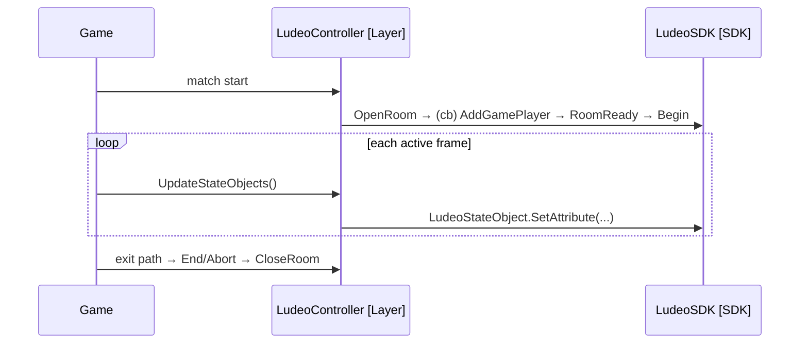
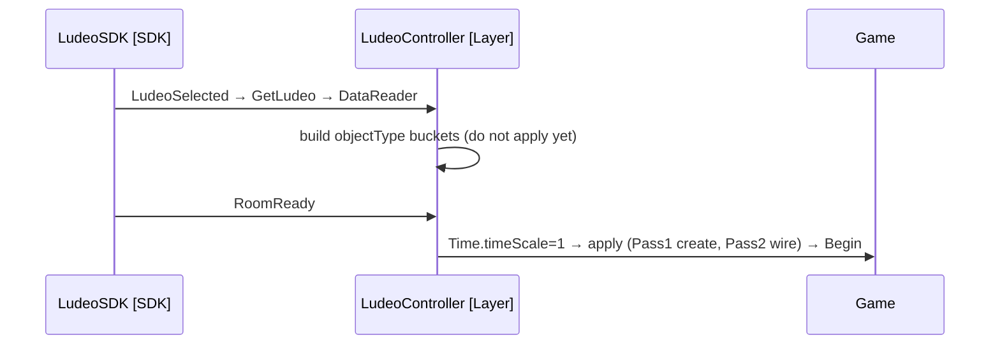

<!-- Ludeo Unity Integration — Technical Design Document template.
     Fill every section from CODE_MAP.json + SDK_INTEGRATION_POINTS.json. Replace example diagrams
     with game-specific ones. Remove all HTML comments from the final output. Flag anything you
     cannot derive from the inputs with: > ⚠️ REQUIRES HUMAN INPUT: ... -->

# Ludeo Integration TDD — <GameName>

## Abstract
<!-- 3–6 sentences: the integration approach for this Unity game, from CODE_MAP findings. -->

## Game Overview
- **Studio:** <!-- ask the user if not in code -->
- **Engine:** Unity <version from CODE_MAP.project_summary> (<render pipeline if known>)
- **Game modes:** <!-- single-player / co-op / multiplayer — infer from code, ask if unclear -->
- **Input system:** <!-- legacy Input / Input System / PlayerInput, from CODE_MAP.input_ai -->
- **3rd parties / key packages:** <!-- from CODE_MAP.packages -->
- **Target platform:** <!-- Windows desktop expected; confirm -->

## Integration Key Concepts
<!-- The strategic section. From the CODE_MAP, define: -->
- **Capture mechanism:** <!-- per-frame UpdateStateObjects() sampling? event-driven? which MonoBehaviours own it -->
- **Reconstruction approach:** <!-- objectType-bucket spawn-from-data (default) vs. re-bind to persistent entities (CR-014) -->
- **Architectural patterns affecting integration:** <!-- scenes (init/menu/level), prefab spawners/pools, singletons/managers, ScriptableObject config -->
- **Threading:** <!-- main-thread expected; note coroutines/async/Jobs if present (CR-013) -->

## State Capture Solution
<!-- How gameplay state is captured for this game. -->
- **Capture flow:** <!-- replace with a game-specific mermaid sequence diagram -->

- **Object lifecycle management:** <!-- from CODE_MAP.object_model: how entities are detected, tracked (one ILudeoStateHandler each), and stopped on Destroy/OnDestroy -->
- **Non-Ludeoable areas:** <!-- menus, loading screens, cutscenes, pause, debug overlays — where tracking must NOT run -->
- **Actions capture:** <!-- from CODE_MAP.event_systems: which player actions → SendAction("..."); genre patterns if relevant -->

## State Reconstruction Solution
- **Reconstruction flow:** <!-- replace with a game-specific mermaid diagram; reflect CR-010 order -->

- **Object recreation process:** <!-- per objectType bucket: spawn N objects, read attributes; dependency resolution by your own key attributes (two-pass, CR-006) -->

## Cloud Specifications
<!-- Deployment decisions — flag for human input. -->
> ⚠️ **REQUIRES HUMAN INPUT:** game mode, settings, NPCs/shaders, game-start configuration.

## Multiplayer Specifications
<!-- If CODE_MAP shows multiplayer, document the room/player architecture + a client-server diagram.
     If single-player only: mark N/A. v1 of this skill targets single-player. -->
N/A (single-player) <!-- or replace -->

## Risks & Open Questions
- **Technical risks (evidence-based — cite CODE_MAP findings):** <!-- check each applicable CR (00-CRITICAL-REQUIREMENTS): CR-001 disable path, CR-005 sampling site, CR-007 all exit paths enumerated?, CR-009 callback wiring, CR-010/011 pause, CR-014 identity. Flag concrete risks only. -->
- **Open questions:** <!-- unresolved items needing human input before implementation -->
- **Dependencies:** <!-- SDK features, package/platform requirements -->
- **Functional requirements:** <!-- SDK capabilities this game's patterns need -->
