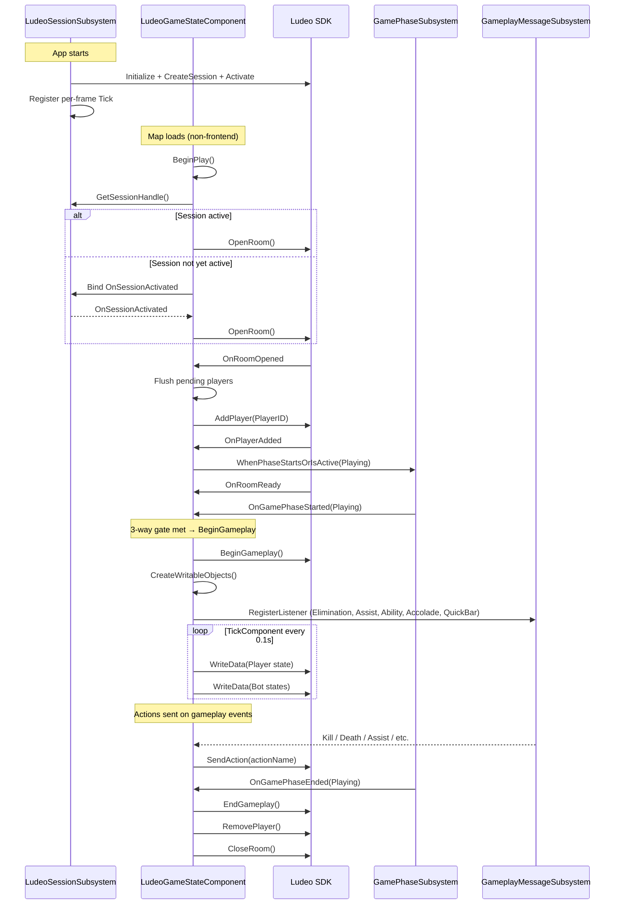
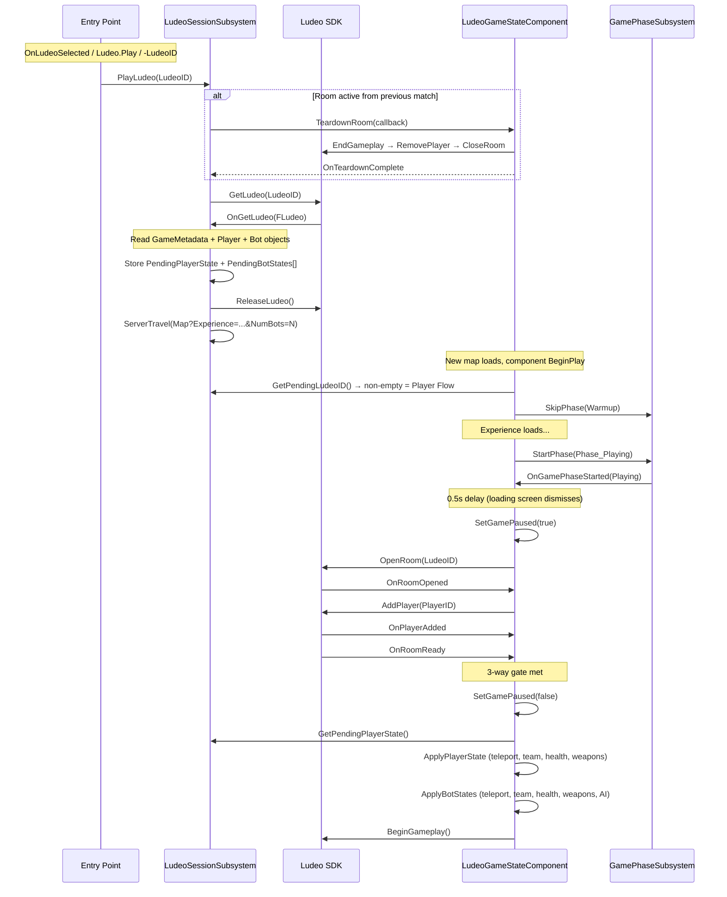

# Lyra x Ludeo Technical Design Document

## Abstract

This TDD documents the integration of Epic's Lyra Starter Game with Ludeo's capture and playback platform. The integration uses a **Subsystem + Component** architecture: a `UGameInstanceSubsystem` (`ULudeoSessionSubsystem`) for SDK lifecycle and a `UGameStateComponent` (`ULudeoGameStateComponent`) for per-match gameplay integration.

State is captured using **manual writable/readable objects** (`FLudeoWritableObject` / `FLudeoReadableObject`). Player actions are detected via Lyra's `UGameplayMessageSubsystem` verb message listeners. The game phase system (`ULyraGamePhaseSubsystem`) drives the lifecycle — a 3-way gate ensures `BeginGameplay` only fires when the room is ready, the player is added, and the Playing phase is active.

The initial integration targets the **Elimination experience** (ShooterCore plugin) in **single-player vs bots** mode. Multiplayer support is deferred to a later phase.

---

## Game Overview

### Studio

Epic Games (sample project) / Ludeo (integration)

### Engine

Unreal Engine 5.7

### Game Modes

- **Elimination** (ShooterCore) — Team deathmatch with respawns, weapon pickups, scoring
- **Control** (ShooterCore) — Objective capture mode
- **TopDownArena** — Alternative top-down perspective mode
- **Frontend** — Main menu experience with CommonUI

Initial integration targets **Elimination** only.

### Graphics API

DirectX 12 (default), DirectX 11 (fallback), Vulkan (optional)

### 3rd Parties

- **CommonGame / CommonUI** — Epic's shared UI framework (menus, widgets, activatable screens)
- **GameplayAbilities (GAS)** — Attribute-based health/damage, ability activation, gameplay effects
- **ModularGameplay** — Component-based actor composition via Game Feature plugins
- **EnhancedInput** — Input mapping and context system
- **CommonSession** — Session management and matchmaking abstraction

### Launchers

Steam (primary target for Ludeo authentication)

---

## Integration Key Concepts

- **Manual Writable Objects**: State is captured using `FLudeoWritableObject` created via `FLudeoRoomWriter::CreateObject()`. Objects tracked: `GameMetadata` (static, written once), `Player` (dynamic, updated every 0.1s), and one `Bot` object per bot (dynamic, updated every 0.1s). This replaces the originally-planned `SaveWorld()` approach because Lyra's equipment and inventory systems use `FFastArraySerializer` which `SaveWorld` cannot iterate correctly.

- **Phase-Aware 3-Way Gate**: `TryBeginGameplay()` requires three conditions: (1) room ready (`OnRoomReady`), (2) player added (`OnPlayerAdded`), and (3) Playing phase active (`OnGamePhaseStarted`). This prevents starting gameplay during loading screens or the warmup countdown.

- **Subsystem + Component Architecture**: Ludeo SDK logic lives in two dedicated classes in the `LudeoIntegration` plugin (`Plugins/GameFeatures/LudeoIntegration/`): `ULudeoSessionSubsystem` (app-lifetime SDK lifecycle) and `ULudeoGameStateComponent` (per-match room lifecycle, state tracking, actions). Lyra core files have minimal touch points.

- **C++ API**: The integration uses the C++ API exclusively. All lifecycle owners and hook points are C++ overrides.

- **Player Flow Pause Pattern**: In Player Flow, the game pauses after a 0.5s timer delay (to let the loading screen dismiss), opens the room with the Ludeo ID, waits for room ready, then unpauses and applies the recorded player state before `BeginGameplay()`.

- **Deferred Session Activation**: The Ludeo session waits for a valid game window handle before activating, ensuring overlay support. A ticker retries each frame until the window is available.

---

## Architecture

### Why Subsystem + Component

The Ludeo integration has two distinct lifetimes:

1. **App-lifetime**: SDK init, per-frame tick, session activation, shutdown, Player Flow entry (fetching Ludeo data, triggering map travel). This persists across map loads.
2. **Match-lifetime**: Room open/close, player add/remove, state tracking, action reporting, Player Flow state application. This resets per match.

A single class cannot serve both. A `UGameInstanceSubsystem` handles (1), a `UGameStateComponent` handles (2).

### Why GameStateComponent (not WorldSubsystem)

| Factor | WorldSubsystem | GameStateComponent |
|--------|---------------|-------------------|
| Ticking | Requires `UTickableWorldSubsystem` (no Lyra precedent) | Built-in `TickComponent` (standard UE pattern) |
| PlayerArray access | Indirect: `GetWorld()->GetGameState()->PlayerArray` | Direct: `GetGameState()->PlayerArray` |
| BeginPlay/EndPlay | Must use `Initialize`/`Deinitialize` (fires at world creation, before GameState exists) | Natural match lifecycle — fires when GameState is ready |
| Replication (future multiplayer) | Cannot replicate (UObject, not Actor) | Built-in replication as part of GameState actor |

```
  APP LIFETIME                           MATCH LIFETIME
  ─────────────                          ──────────────

┌─────────────────────────────┐     ┌──────────────────────────────────┐
│ ULudeoSessionSubsystem      │     │ ULudeoGameStateComponent         │
│ (UGameInstanceSubsystem)    │     │ (UGameStateComponent)            │
│                             │     │                                  │
│ LudeoIntegration/           │     │ LudeoIntegration/                │
│  .../Public/                │     │  .../Public/                     │
│   LudeoSessionSubsystem.h   │     │   LudeoGameStateComponent.h     │
│  .../Private/               │     │  .../Private/                    │
│   LudeoSessionSubsystem.cpp │     │   LudeoGameStateComponent.cpp   │
│                             │     │                                  │
│ SDK LIFECYCLE               │     │ ROOM LIFECYCLE                   │
│ ├ FLudeoManager init/tick   │────►│ ├ OpenRoom (BeginPlay)           │
│ ├ Session create/activate   │sess.│ ├ AddPlayer / RemovePlayer       │
│ ├ Session destroy/shutdown  │hndl │ ├ 3-way gate → BeginGameplay     │
│ └ Deferred window handle    │     │ ├ EndGameplay → CloseRoom        │
│                             │     │ └ EndPlay cleanup                │
│ NOTIFICATIONS               │     │                                  │
│ ├ OnPauseGameRequested      │     │ STATE TRACKING (Creator Flow)    │
│ ├ OnResumeGameRequested     │     │ ├ Create writable objects        │
│ ├ OnGameBackToMenu          │     │ ├ TickComponent @ 10Hz           │
│ ├ OnPlayerConsentUpdated    │     │ └ Destroy writable objects       │
│ ├ OnLocalizationUpdated     │     │                                  │
│ └ OnMuteGameRequested       │     │ ACTION REPORTING                 │
│                             │     │ ├ Elimination (Kill/Death)       │
│ PLAYER FLOW ENTRY           │     │ ├ Damage type tags on kills      │
│ ├ OnLudeoSelected           │     │ ├ WeaponPickup / HealthPickup    │
│ ├ Ludeo.Play console cmd    │     │ ├ Assist / Grenade / Dash        │
│ ├ -LudeoID= launch arg     │     │ ├ Multi-kill / Streak accolades  │
│ ├ GetLudeo → read state     │     │ └ Pause / Resume                 │
│ └ ServerTravel to map       │     │                                  │
│                             │     │ PLAYER FLOW (State Restoration)  │
│ TEARDOWN COORDINATION       │     │ ├ Phase skip (warmup bypass)     │
│ ├ PlayLudeo → teardown if   │     │ ├ Pause/unpause timing           │
│ │  room active, then fetch  │────►│ ├ ApplyPlayerState               │
│ ├ BackToMenu → teardown     │read │ └ ApplyBotStates                 │
│ │  then travel to frontend  │     │                                  │
│ └ OnTeardownComplete        │     │ TEARDOWN                         │
│                             │     │ ├ TeardownRoom(callback)         │
│ PENDING STATE               │     │ ├ EndGameplay → RemovePlayer     │
│ ├ PendingPlayerState        │────►│ │  → CloseRoom                   │
│ ├ PendingBotStates[]        │     │ └ InvokeTeardownCallback         │
│ └ PendingLudeoID            │     │                                  │
└─────────────────────────────┘     └──────────────────────────────────┘
                                      │           ▲            ▲
                          attaches via │           │            │
                          StaticLoad-  │    observes via   listens via
                          Class (no    │    WhenPhase*()   RegisterListener()
                          compile dep) │           │            │
                                      ▼           │            │
                              ┌──────────────┐  ┌─┴────────────┴──────┐
                              │ALyraGameState│  │ULyraGamePhaseSubsys │
                              │(delegates +  │  │UGameplayMessageSubsys│
                              │ runtime load)│  └──────────────────────┘
                              └──────────────┘
```

---

## State Capture Solution (Creator Flow)

State is captured using `FLudeoWritableObject` instances created in `ULudeoGameStateComponent::CreateWritableObjects()` after `BeginGameplay()`. Objects created: one `GameMetadata` (static), one `Player` (dynamic), and one `Bot` per bot player in the match (dynamic). Dynamic objects are updated every 0.1s in `UpdateWritableObjects()` via `TickComponent()`.

See [Ludeo_Tracked_Data.md](Ludeo_Tracked_Data.md) for the complete tracked data reference.

### Creator Flow Sequence



### 3-Way Gate (`TryBeginGameplay`)

`ULudeoGameStateComponent` tracks three conditions. Whichever fires last triggers `BeginGameplay()`:

```cpp
// ULudeoGameStateComponent — TryBeginGameplay()
if (bGameplayStarted || !bRoomReady || !PlayerHandle.IsSet() || !bGamePhaseActive)
{
    return; // Not all conditions met yet
}
// ... all 3 conditions met, proceed
bGameplayStarted = true;
Player->BeginGameplay(FLudeoPlayerBeginGameplayParameters{});
```

| Condition | Set By | Callback |
| --- | --- | --- |
| `bRoomReady` | SDK notification | `OnRoomReady` |
| `PlayerHandle` | SDK callback | `OnPlayerAdded` |
| `bGamePhaseActive` | Phase subsystem | `OnGamePhaseStarted` |

---

## State Reconstruction Solution (Player Flow)

Player Flow starts when the user selects a Ludeo (via SDK callback, console command, or launch argument). The subsystem fetches the Ludeo data, reads the map, player state, and bot states, then travels to the correct map. After loading, the component skips warmup, force-starts Playing phase, pauses the game, opens the room with the Ludeo ID, and resumes once ready — applying the recorded position, aim direction, team, health, and weapon loadout for the player and all bots.

### Player Flow Sequence



### State Application (`ApplyPlayerState`)

Applied after unpause in `TryBeginGameplay()`, before `BeginGameplay()`:

1. **Position & Rotation**: `Pawn->TeleportTo(Position, Rotation)` — applied after unpause so `CharacterMovementComponent` processes the teleport correctly.

2. **Control Rotation (Camera/Aim)**: `Controller->SetControlRotation(ControlRotation)` — restores the player's aim direction. The camera system (`ULyraCameraComponent`) derives its view from control rotation + camera mode offsets, so this is sufficient to restore the full camera view.

3. **Team**: `ALyraPlayerState::SetGenericTeamId(FGenericTeamId(TeamID))` — ensures the player is on the correct team.

4. **Health**: Deferred via `ULyraPawnExtensionComponent::OnAbilitySystemInitialized_RegisterAndCall()` + next-tick timer. This ensures health is applied after `ULyraHealthComponent::InitializeWithAbilitySystem()` resets health to max. Sets `MaxHealth` first (for correct clamping), then `Health`, then broadcasts `OnHealthChanged` to update UI.

5. **Weapon Loadout**:
   - Clear all existing QuickBar slots and remove items from inventory
   - For each recorded weapon path: load the `ULyraInventoryItemDefinition` class, add to inventory via `AddItemDefinition()`, place in slot via `AddItemToSlot()`
   - Set active weapon slot via `SetActiveSlotIndex()`
   - Both `ULyraQuickBarComponent` and `ULyraInventoryManagerComponent` live on the **Controller** (not the Pawn)

6. **Bot State**: For each recorded bot (matched by index, not name — bot names are random per session):
   - `TeleportTo(Position, Rotation)` + `SetControlRotation(ControlRotation)`
   - `SetGenericTeamId(TeamID)`
   - Health applied with same deferred pattern as the player (per-bot `OnAbilitySystemInitialized` callback)
   - Weapon loadout restored
   - `AIController->SetFocus(FocusTarget actor)` or `ClearFocus` if empty

### Player Flow Entry Points

| Entry Point | Handler | When |
| --- | --- | --- |
| SDK `OnLudeoSelected` callback | `ULudeoSessionSubsystem::OnLudeoSelected` → `PlayLudeo()` | User selects a Ludeo in the SDK overlay |
| Console command `Ludeo.Play <ID>` | `ULudeoSessionSubsystem::PlayLudeo()` | Developer testing during PIE |
| Launch argument `-LudeoID=<ID>` | `ULudeoSessionSubsystem::CheckCommandLineLudeo()` → `PlayLudeo()` | Cloud Player Flow or automated testing |

All three call `PlayLudeo()` which checks for an active room (tears down if needed), fetches the Ludeo data, reads state, and triggers `ServerTravel`.

### Bot Reconstruction (Player Flow)

Bots are reconstructed using an **Initial State + AI Continuation** approach. The Ludeo SDK provides a snapshot of each bot's last recorded state (not a frame-by-frame timeline). During Player Flow, each bot's physical state is restored once, then the Behavior Tree continues making new decisions. Bots **will diverge** from the recording after restoration; this is expected and acceptable.

See [Lyra_AI_Reference.md](Lyra_AI_Reference.md) for full bot AI architecture details.

#### What gets restored per bot

| Attribute | How Restored |
| --- | --- |
| Position + Rotation | `Pawn->TeleportTo(Position, Rotation)` |
| ControlRotation | `Controller->SetControlRotation(ControlRotation)` — restores aim direction |
| TeamID | `ALyraPlayerState::SetGenericTeamId(FGenericTeamId(TeamID))` |
| Weapon loadout | Clear QuickBar, load weapon defs from recorded paths, place in slots, set active slot |
| FocusTarget | Find actor by name via `TActorIterator` → `AIController->SetFocus(Actor)` (or `ClearFocus` if empty) |
| Health / MaxHealth | Deferred via `OnAbilitySystemInitialized_RegisterAndCall` + next-tick — same pattern as player health |
| MoveStatus / PerceivedEnemies | Stored in `FLudeoBotInitialState` but read-only — BT and perception rebuild automatically |

#### Bot Identity Matching — Index-Based

Bot names are assigned randomly from `LyraBotCreationComponent::RandomBotNames[]` and differ between recording and playback. Matching uses **array index order** (first recorded bot → first spawned bot), not name matching. The recorded `BotCount` in GameMetadata is passed as `?NumBots=N` in the travel URL, ensuring the same number of bots spawn.

#### FLudeoBotInitialState Struct

```cpp
struct FLudeoBotInitialState
{
    FString BotName;
    FVector Position = FVector::ZeroVector;
    FRotator Rotation = FRotator::ZeroRotator;
    FRotator ControlRotation = FRotator::ZeroRotator;
    int32 TeamID = INDEX_NONE;
    float Health = 0.f;
    float MaxHealth = 0.f;
    TArray<FString> WeaponSlotPaths;
    int32 ActiveWeaponSlot = 0;
    FString FocusTarget;
    int32 MoveStatus = 0;
    int32 PerceivedEnemies = 0;
};
```

---

## SDK Lifecycle & Callbacks

### Full Lifecycle

```text
LYRA                                              LUDEO
────                                              ─────
ULudeoSessionSubsystem::Initialize()        →    Initialize + Tick + CreateSession + Activate
  (deferred activation waits for window)          (overlay needs window handle)
OnLudeoSelected / Ludeo.Play / -LudeoID      →    PlayLudeo → teardown if needed → GetLudeo → ServerTravel
ULudeoGameStateComponent::BeginPlay()        →    OpenRoom (Creator or Player Flow)
  OnPlayerStateAddedEvent broadcast           →    AddPlayer per human player
OnRoomOpened + OnPlayerAdded + PhaseActive   →    TryBeginGameplay (3-way gate)
  [Active gameplay]                               [State tracking + Actions]
OnGamePhaseEnded(Playing) / TeardownRoom()   →    EndGameplay + RemovePlayer + CloseRoom
ULudeoSessionSubsystem::Deinitialize()       →    DestroySession + Remove Tick + Finalize
```

### Startup Sequence (`Initialize`)

All Ludeo initialization occurs in `ULudeoSessionSubsystem::Initialize()`:

1. `FLudeoManager::GetInstance()` → `Initialize()` — creates the Ludeo singleton
2. `FTSTicker::AddTicker()` — registers per-frame tick for `FLudeoManager::Tick()`
3. `FLudeoSessionManager::CreateSession()` — creates the session object
4. Register 7 notification callbacks (see table below)
5. Register `Ludeo.Play` console command
6. `ActivateSession()` — checks for window handle, defers if not available
   - On success: stores session handle, checks `-LudeoID` launch arg
   - If window not ready: starts a ticker that retries each frame

### Shutdown Sequence (`Deinitialize`)

1. Remove deferred activation ticker (if still pending)
2. `FLudeoSessionManager::DestroySession(SessionHandle)`
3. Remove SDK ticker delegate
4. `FLudeoManager::Finalize()`

### Callback Reference

| Callback | Handler | Purpose |
| --- | --- | --- |
| `OnLudeoSelected` | `OnLudeoSelected` → `PlayLudeo()` | Player Flow entry |
| `OnPauseGameRequested` | `OnPauseGameRequested` | SDK requests game pause (overlay shown) |
| `OnResumeGameRequested` | `OnResumeGameRequested` | SDK requests game resume |
| `OnGameBackToMenuRequested` | `OnGameBackToMainMenuRequested` | Teardown room, then travel to frontend |
| `OnPlayerConsentUpdated` | `OnPlayerConsentUpdated` | Update `bCanCreateLudeo`/`bCanPlayLudeo` |
| `OnLocalizationUpdated` | `OnLocalizationUpdated` | Refresh UI language |
| `OnMuteGameRequested` | `OnMuteGameRequested` | Mute/unmute game audio |

---

## Class Specifications

### ULudeoSessionSubsystem

**Base class**: `UGameInstanceSubsystem`
**Header**: `Plugins/GameFeatures/LudeoIntegration/Source/LudeoIntegrationRuntime/Public/LudeoSessionSubsystem.h`
**Source**: `Plugins/GameFeatures/LudeoIntegration/Source/LudeoIntegrationRuntime/Private/LudeoSessionSubsystem.cpp`

**Public interface**:

```cpp
UCLASS()
class ULudeoSessionSubsystem : public UGameInstanceSubsystem
{
    GENERATED_BODY()

public:
    virtual void Initialize(FSubsystemCollectionBase& Collection) override;
    virtual void Deinitialize() override;

    bool IsSessionActivated() const;
    const TOptional<FLudeoSessionHandle>& GetSessionHandle() const;

    const FString& GetPendingLudeoID() const;
    void ClearPendingLudeoID();
    const FLudeoPlayerInitialState& GetPendingPlayerState() const;
    void ClearPendingPlayerState();
    const TArray<FLudeoBotInitialState>& GetPendingBotStates() const;
    void ClearPendingBotStates();

    void PlayLudeo(const FString& LudeoID);

    FOnLudeoSessionActivatedEvent OnSessionActivatedEvent;
};
```

**Structs defined here**:

```cpp
struct FLudeoPlayerInitialState { /* position, rotation, weapons, health, team */ };
struct FLudeoBotInitialState    { /* position, rotation, weapons, health, team, AI */ };
```

**Private helpers**:

- `FindActiveGameStateComponent()` — locates `ULudeoGameStateComponent` on the current GameState
- `FetchAndTravelToLudeo()` — calls `GetLudeo()`, reads state, triggers `ServerTravel`
- `TravelToFrontEnd()` — `ServerTravel` to the frontend map
- `OnTeardownComplete(bool bSuccess)` — dispatches pending action (PlayLudeo or BackToMenu) after room teardown

**Teardown coordination**: When `PlayLudeo()` or `OnGameBackToMainMenuRequested()` is called while a room is active, the subsystem requests `TeardownRoom()` on the component and defers the action until the callback fires.

### ULudeoGameStateComponent

**Base class**: `UGameStateComponent` (from ModularGameplay plugin)
**Header**: `Plugins/GameFeatures/LudeoIntegration/Source/LudeoIntegrationRuntime/Public/LudeoGameStateComponent.h`
**Source**: `Plugins/GameFeatures/LudeoIntegration/Source/LudeoIntegrationRuntime/Private/LudeoGameStateComponent.cpp`

**Public interface**:

```cpp
bool IsRoomActive() const { return bRoomOpen || bRoomRequested; }
void TeardownRoom(FOnRoomTeardownComplete OnComplete);
```

**Lifecycle**:
- `BeginPlay()`: Check map name (skip frontend), get session handle from subsystem, open room or defer via `OnSessionActivatedEvent`
- `TickComponent()`: Update writable objects at 10Hz, detect pause state transitions
- `EndPlay()`: EndGameplay → RemovePlayer → CloseRoom chain, unbind from subsystem delegate

**Room lifecycle** (private):
- `TryOpenRoom()`, `OpenRoom()`, `OnRoomOpened()`, `OnRoomReady()`
- `AddPlayerToRoom()`, `OnPlayerAdded()`, `RemovePlayerFromRoom()`
- `TryBeginGameplay()` — 3-way gate (room ready + player added + phase active)
- `EndGameplay()`, `OnEndGameplayComplete()`, `OnPlayerRemoved()`, `CloseRoom()`
- `TeardownRoom()` → `InvokeTeardownCallback()` — external teardown API

**State tracking** (private, Creator Flow):
- `CreateWritableObjects()` — GameMetadata + Player + Bot per bot
- `UpdateWritableObjects()` — called from TickComponent at 10Hz
- `DestroyWritableObjects()`

**Action handlers** (private):
- `OnEliminationMessage()` — Kill, Death, damage type tags
- `OnInventoryChanged()` — WeaponPickup (debounced, spawn-suppressed via slot count)
- `OnAssistMessage()` — Assist
- `OnAbilityActivated()` — Grenade, Dash
- `OnAccoladeMessage()` — DoubleKill through PentaKill, KillStreak5 through KillStreak20
- HealthPickup detected in `UpdateWritableObjects()` via health delta comparison

**Player Flow** (private):
- `OnExperienceLoadedForPlayerFlow()` — force-start Playing phase
- `PauseAndOpenPlayerFlowRoom()` — pause, open room with LudeoID
- `OnGamePhaseStarted()` / `OnGamePhaseEnded()` — phase observers
- `ApplyPlayerState()` — teleport, team, deferred health, weapon loadout
- `ApplyPendingHealth()` — deferred via OnAbilitySystemInitialized + next-tick
- Bot state application (position, rotation, team, health, weapons, AI focus)

---

## File Map

| Class | File | Role |
| --- | --- | --- |
| `ULudeoSessionSubsystem` | `LudeoIntegration/...Public/LudeoSessionSubsystem.h`<br>`LudeoIntegration/...Private/LudeoSessionSubsystem.cpp` | SDK startup, shutdown, session lifecycle, Player Flow entry, Ludeo data reading, teardown coordination |
| `ULudeoGameStateComponent` | `LudeoIntegration/...Public/LudeoGameStateComponent.h`<br>`LudeoIntegration/...Private/LudeoGameStateComponent.cpp` | Room lifecycle, 3-way gate, writable object tracking, action capture, Player Flow state application, teardown chain |
| `FLudeoPlayerInitialState` | `LudeoIntegration/...Public/LudeoSessionSubsystem.h` | Struct carrying player state from subsystem → component |
| `FLudeoBotInitialState` | `LudeoIntegration/...Public/LudeoSessionSubsystem.h` | Struct carrying bot state from subsystem → component |
| `ULyraGamePhaseSubsystem` | `Source/LyraGame/AbilitySystem/Phases/LyraGamePhaseSubsystem.h/.cpp` | Phase observers, `SkipPhase`/`StartPhase` for Player Flow warmup bypass |
| `ULyraAbilitySystemComponent` | `Source/LyraGame/AbilitySystem/LyraAbilitySystemComponent.cpp` | Ability activation broadcast via `Lyra.Ability.Activated.Message` |
| `ALyraGameState` | `Source/LyraGame/GameModes/LyraGameState.h/.cpp` | Loads `ULudeoGameStateComponent` at runtime via `StaticLoadClass` (no compile-time dependency); broadcasts `OnPlayerStateAddedEvent`/`OnPlayerStateRemovedEvent` delegates |

### Lyra Core File Touch Points

| File | Change |
|------|--------|
| `LyraGameState.h` | `OnPlayerStateAddedEvent`/`OnPlayerStateRemovedEvent` delegate declarations |
| `LyraGameState.cpp` | Runtime class lookup via `StaticLoadClass` + `CreateComponentFromClass` (no `#include` of plugin header); broadcasts `OnPlayerStateAddedEvent`/`OnPlayerStateRemovedEvent` instead of calling component methods directly |
| `LyraGamePhaseSubsystem.h/.cpp` | `SkipPhase`/`ClearSkippedPhases` API (10 lines, generic) |
| `LyraAbilitySystemComponent.cpp` | `NotifyAbilityActivated` broadcast (5 lines, generic) |

---

## Configuration

### Plugin Registration

Add the LudeoUESDK plugin to `Lyra.uproject`:

```json
{
    "Name": "LudeoUESDK",
    "Enabled": true
}
```

### Config Files

| File | Setting | Purpose |
| --- | --- | --- |
| `Config/DefaultGame.ini` | `[Ludeo.SessionActivate]` section with `APIKey`, `GameVersion` | Ludeo SDK connection settings |
| `Config/DefaultGame.ini` | `AuthenticationType=Steam`, `SteamAuthenticationID_1`, `SteamBetaBranchName` | Explicit Steam auth for editor/dev builds |

Authentication is skipped entirely when `-cloud` is passed on the command line (for cloud builds).

### Debug & Testing

| Entry Point | Usage |
| --- | --- |
| `Ludeo.Play <LudeoID>` | Console command — triggers Player Flow from editor output log |
| `-LudeoID=<id>` | Launch argument — auto-starts Player Flow after session activation |

---

## Non-Ludeoable Areas

| Area | Type | Reason |
| --- | --- | --- |
| Frontend experience (main menu) | Non-Ludeoable | No gameplay state to capture |
| Experience loading phase | Skipped/Paused | Game is not interactive; loading screens displayed |
| Warmup phase (pre-match countdown) | Skipped (Player Flow) / Gated (Creator Flow) | `BeginGameplay` waits for Playing phase via 3-way gate |
| PostGame phase (scoreboard) | EndGameplay trigger | `Playing` phase ends → `EndGameplay()` |

---

## Multiplayer Specifications

> **Note**: Multiplayer is deferred to Phase 2. The current implementation tracks a single human player.
>
> **Bot tracking**: Bots are tracked as `FLudeoWritableObject` instances (ObjectType: `"Bot"`) — they are NOT added as Ludeo players via `AddPlayer()`. One writable object per bot captures position, rotation, control rotation, team, health, weapons, and AI observables (FocusTarget, MoveStatus, PerceivedEnemies) at the same 0.1s update rate as the Player object. Bot objects are keyed by `PlayerState->GetPlayerName()` and stored in `TMap<FString, FLudeoWritableObject> BotObjects` on `ULudeoGameStateComponent`. Bot objects must be written outside the player's scoped guard (Ludeo SDK does not support nested object guards).
>
> **Bot Player Flow**: During playback, bot readable objects are read from the Ludeo data. Each bot's state (position, rotation, control rotation, team, health, weapons, focus target) is restored once. MoveStatus and PerceivedEnemies are stored but not directly applicable — the bot AI rebuilds these from its behavior tree and perception system. Bots are matched by array index (first recorded → first spawned). The Behavior Tree then continues from the restored state — bots make new decisions and will diverge from the recording. Bot count is controlled by recording `BotCount` in GameMetadata and passing it as `?NumBots=N` in the travel URL. See [Bot Reconstruction (Player Flow)](#bot-reconstruction-player-flow) for full design.

---

## Risks & Open Questions

### Resolved

| Item | Resolution |
| --- | --- |
| GAS Attribute Serialization | Not needed — manual writable objects track only position/rotation/weapons, not GAS attributes |
| FastArraySerializer Equipment | Handled via manual writable objects writing `GetPathName()` per QuickBar slot |
| Experience Load Timing | 3-way gate ensures gameplay starts only after experience loads and Playing phase is active |
| Map-to-experience mapping | Stored as `ExperienceAsset` in the GameMetadata writable object; read back in `OnGetLudeo` |
| Bot identity matching | Bots matched by index order (first recorded → first spawned). `BotCount` ensures same number spawn via `?NumBots=N` travel URL. |
| Scoped guard nesting | Bot writes happen outside the player's guard scope via `{ }` braces so guards are destroyed before bot writes begin. |
| Ability tag discovery | Grenade/Dash confirmed as `Ability.Type.Action.Grenade` and `Ability.Type.Action.Dash`. Unrecognized activations logged at Verbose level. |
| Architecture — direct class modification | Resolved by refactoring to Subsystem + Component pattern. All Ludeo code lives in the `LudeoIntegration` plugin (`Plugins/GameFeatures/LudeoIntegration/`). `ALyraGameState` has no compile-time dependency on the plugin — it loads the component class at runtime via `StaticLoadClass` and communicates via `OnPlayerStateAddedEvent`/`OnPlayerStateRemovedEvent` delegates. |
| Stale rooms on seamless travel | Resolved via `TeardownRoom()` callback pattern — subsystem coordinates teardown before PlayLudeo or BackToMenu. |

### Open

| Risk | Severity | Mitigation |
| --- | --- | --- |
| Weapon pickup slot assignment | Medium | QuickBar slot assignment for pickups is Blueprint-driven. The write code handles all `Slots.Num()` slots dynamically. Debug logging is in place to diagnose. |
| Bot recreation fidelity | Medium | Bots use AI behavior — their state diverges from the recorded moment. Physical state + AI focus restored; full Blackboard is not. Divergence after restoration is expected and acceptable. |
| State tracking performance | Low | Writes happen every 0.1s (not every tick). Adding bot objects (typically 5 bots in Elimination) increases write volume ~6x. No performance issues observed. |

### Dependencies

- **LudeoUESDK Plugin** — Must be compatible with UE 5.7
- **Steam Client** — Required for authentication (skipped with `-cloud` flag)
- **Studio Labs Configuration** — API key, environment setup
- **ShooterCore Game Feature** — Contains Elimination experience, weapon spawners

---

## Related Documents

- [Ludeo_Tracked_Data.md](Ludeo_Tracked_Data.md) — Complete tracked data reference (actions, state objects, Player Flow reconstruction)
- [Lyra_Ludeo_Lifecycle_Map.md](Lyra_Ludeo_Lifecycle_Map.md) — SDK call → Lyra code mapping
- [Lyra_AI_Reference.md](Lyra_AI_Reference.md) — Bot AI architecture in Lyra's Elimination experience
- [LUDEO_UE_INTEGRATION_SPEC.md](LUDEO_UE_INTEGRATION_SPEC.md) — General Ludeo SDK integration specification
- [CloudBuild_TDD.md](CloudBuild_TDD.md) — Cloud build packaging and deployment
