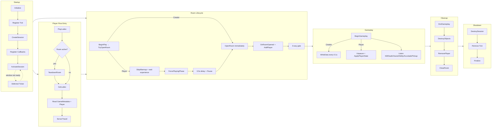
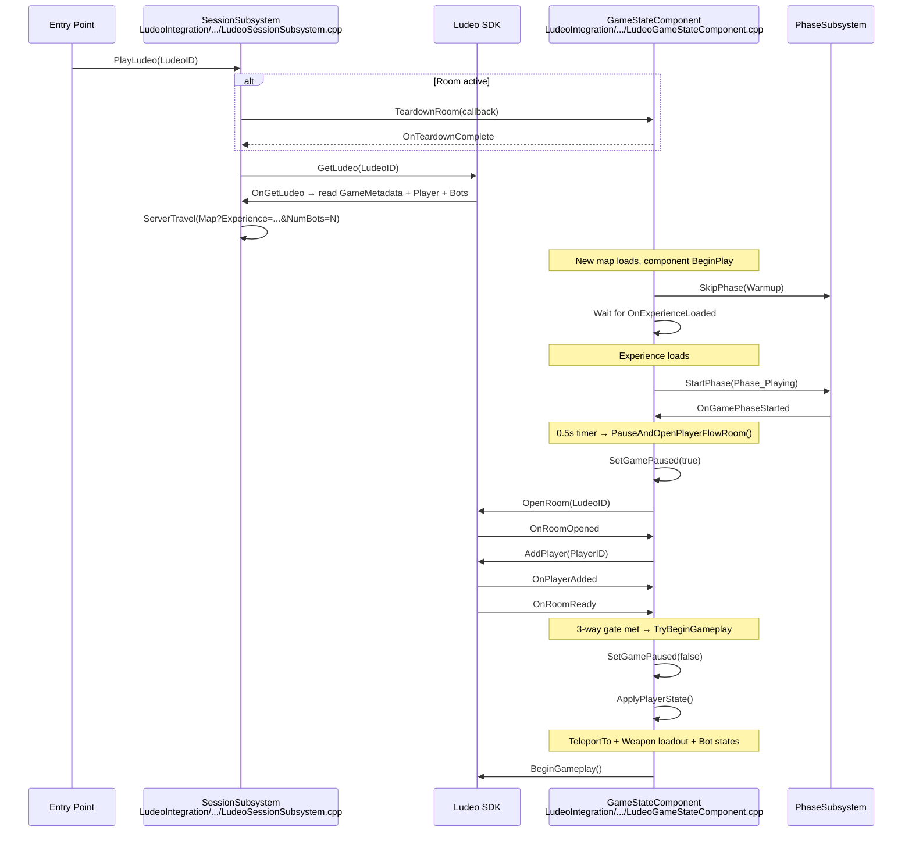
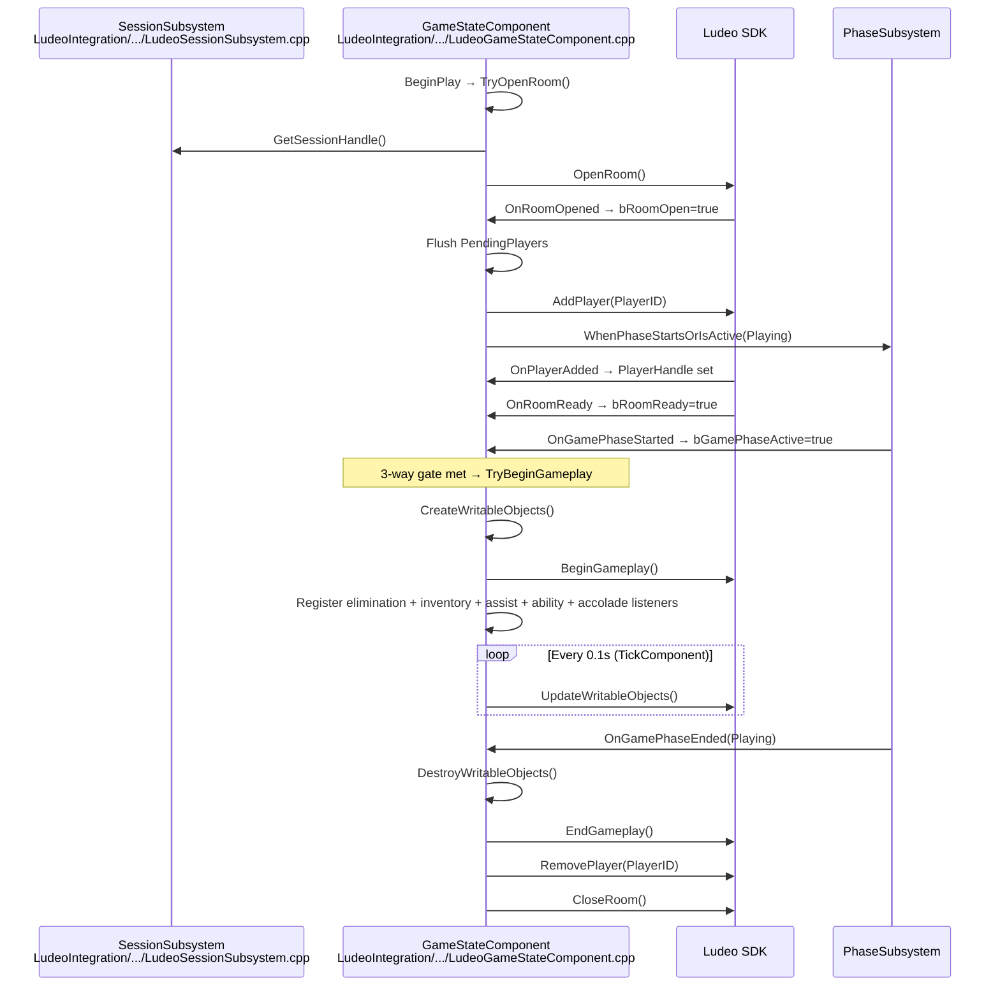

# Lyra x Ludeo SDK Lifecycle Map

> Where every SDK call lives in Lyra — mapped to actual implementation.

---

## Lifecycle Overview



---

## Startup

> `ULudeoSessionSubsystem::Initialize()` — called when the GameInstance subsystem initializes
>
> File: `Plugins/GameFeatures/LudeoIntegration/.../LudeoSessionSubsystem.cpp`

| Step | SDK Call | Code Location |
| --- | --- | --- |
| 1 | `FLudeoManager::GetInstance()` → `Initialize()` | `Initialize()` |
| 2 | `FTSTicker::AddTicker()` for SDK tick | `Initialize()` |
| 3 | `FLudeoSessionManager::CreateSession()` | `Initialize()` |
| 4 | Register 7 notification callbacks | `Initialize()` |
| 5 | Register `Ludeo.Play` console command | `Initialize()` |
| 6 | `ActivateSession()` (defers if no window) | `Initialize()` → `ActivateSession()` |
| 7 | `FLudeoSession::Activate()` | `ActivateSession()` |
| 8 | Check `-LudeoID` launch arg | `OnSessionActivated()` → `CheckCommandLineLudeo()` |

---

## Player Flow Entry

> `ULudeoSessionSubsystem::PlayLudeo()` — triggered by SDK callback, console command, or launch arg
>
> File: `Plugins/GameFeatures/LudeoIntegration/.../LudeoSessionSubsystem.cpp`

| Step | SDK Call | Code Location |
| --- | --- | --- |
| 1 | Check for active room → `TeardownRoom()` if needed | `PlayLudeo()` |
| 2 | `FLudeoSession::GetLudeo(LudeoID)` | `FetchAndTravelToLudeo()` |
| 3 | Read `GameMetadata` object (MapName, ExperienceAsset) | `OnGetLudeo()` |
| 4 | Read `Player` + `Bot` objects (Position, Rotation, Weapons, AI) | `OnGetLudeo()` |
| 5 | `FLudeoSession::ReleaseLudeo()` | `OnGetLudeo()` |
| 6 | `GetWorld()->ServerTravel(MapName?Experience=...&NumBots=N)` | `OnGetLudeo()` |

### Player Flow sequence



---

## Creator Flow Room Lifecycle

> `ULudeoGameStateComponent::TryOpenRoom()` → `OpenRoom()` — called from BeginPlay when session is activated
>
> File: `Plugins/GameFeatures/LudeoIntegration/.../LudeoGameStateComponent.cpp`

| Step | SDK Call | Code Location |
| --- | --- | --- |
| 1 | `FLudeoSession::OpenRoom()` | `OpenRoom()` (Creator branch) |
| 2 | Register `OnRoomReady` delegate | `OpenRoom()` |
| 3 | Flush pending players on `OnRoomOpened` | `OnRoomOpened()` |
| 4 | Register `WhenPhaseStartsOrIsActive(Playing)` | `OnRoomOpened()` |
| 5 | `FLudeoRoom::AddPlayer(PlayerID)` | `AddPlayerToRoom()` |
| 6 | `TryBeginGameplay()` (on each callback) | `OnRoomReady()`, `OnPlayerAdded()`, `OnGamePhaseStarted()` |

### Creator Flow sequence



---

## Gameplay

> `ULudeoGameStateComponent::TryBeginGameplay()` — fires when 3-way gate is satisfied
>
> File: `Plugins/GameFeatures/LudeoIntegration/.../LudeoGameStateComponent.cpp`

| SDK Call | Code Location | Notes |
| --- | --- | --- |
| `FLudeoPlayer::BeginGameplay()` | `TryBeginGameplay()` | After 3-way gate |
| `FLudeoWritableObject::WriteData()` | `UpdateWritableObjects()` | Every 0.1s, Creator Flow only |
| `FLudeoRoomWriter::SendAction("Kill")` | `OnEliminationMessage()` | Instigator matches tracked player |
| `FLudeoRoomWriter::SendAction("Death")` | `OnEliminationMessage()` | Target matches tracked player |
| `FLudeoRoomWriter::SendAction(DamageType)` | `OnEliminationMessage()` | All damage type tags from kill context |
| `FLudeoRoomWriter::SendAction("WeaponPickup")` | `OnInventoryChanged()` | Debounced 1s, suppressed if <2 slots or near spawn |
| `FLudeoRoomWriter::SendAction("HealthPickup")` | `UpdateWritableObjects()` | Health increase outside respawn window |
| `FLudeoRoomWriter::SendAction("Assist")` | `OnAssistMessage()` | Player assisted a kill |
| `FLudeoRoomWriter::SendAction("Grenade")` | `OnAbilityActivated()` | Grenade ability tag |
| `FLudeoRoomWriter::SendAction("Dash")` | `OnAbilityActivated()` | Dash ability tag |
| `FLudeoRoomWriter::SendAction(Accolade)` | `OnAccoladeMessage()` | DoubleKill–PentaKill, KillStreak5–20 |
| `FLudeoRoomWriter::SendAction(Pause/Resume)` | `TickComponent()` | Pause state transitions |
| `ApplyPlayerState()` | `TryBeginGameplay()` | Player Flow only — TeleportTo + weapon loadout + bot states |

---

## Cleanup

> `ULudeoGameStateComponent::EndGameplay()` — triggered by Playing phase end, EndPlay, or TeardownRoom
>
> File: `Plugins/GameFeatures/LudeoIntegration/.../LudeoGameStateComponent.cpp`

| Step | SDK Call | Code Location |
| --- | --- | --- |
| 1 | `DestroyWritableObjects()` | `EndGameplay()` (Creator Flow only) |
| 2 | Unregister all message listeners | `EndGameplay()` |
| 3 | `FLudeoPlayer::EndGameplay()` | `EndGameplay()` |
| 4 | `FLudeoRoom::RemovePlayer()` | `OnEndGameplayComplete()` |
| 5 | `FLudeoSession::CloseRoom()` | `CloseRoom()` (after `OnPlayerRemoved`) |
| 6 | `InvokeTeardownCallback()` | `CloseRoom()` — notifies subsystem if teardown was requested |

Safety net: `EndPlay()` calls `EndGameplay()` which triggers the full chain if still running.

**External teardown**: The subsystem can request `TeardownRoom(callback)` before PlayLudeo or BackToMenu. The component runs EndGameplay→RemovePlayer→CloseRoom, then fires the callback.

---

## Shutdown

> `ULudeoSessionSubsystem::Deinitialize()` — called when the GameInstance is destroyed
>
> File: `Plugins/GameFeatures/LudeoIntegration/.../LudeoSessionSubsystem.cpp`

| Step | SDK Call | Code Location |
| --- | --- | --- |
| 1 | Remove deferred activation ticker | `Deinitialize()` |
| 2 | `FLudeoSessionManager::DestroySession()` | `Deinitialize()` |
| 3 | Remove SDK ticker | `Deinitialize()` |
| 4 | `FLudeoManager::Finalize()` | `Deinitialize()` |

---

## File Summary

| Class | File | Role |
| --- | --- | --- |
| `ULudeoSessionSubsystem` | `LudeoIntegration/.../LudeoSessionSubsystem.h/.cpp` | SDK startup, shutdown, session lifecycle, Player Flow entry, Ludeo data reading, teardown coordination |
| `ULudeoGameStateComponent` | `LudeoIntegration/.../LudeoGameStateComponent.h/.cpp` | Room lifecycle, 3-way gate, writable object tracking, action capture, Player Flow state application, teardown chain |
| `ULyraGamePhaseSubsystem` | `AbilitySystem/Phases/LyraGamePhaseSubsystem.h/.cpp` | Phase observers (`WhenPhaseStartsOrIsActive`, `WhenPhaseEnds`), `SkipPhase`/`StartPhase` for Player Flow |

---

## Quick Reference

```text
STARTUP                    ROOM                      GAMEPLAY                CLEANUP              SHUTDOWN
───────                    ────                      ────────                ───────              ────────
Initialize                 OpenRoom                  BeginGameplay           EndGameplay          DestroySession
Tick (register)            AddPlayer                 WriteData (0.1s)        DestroyObjects       Remove Tick
CreateSession              OnRoomReady               SendAction(Kill/Death)  RemovePlayer         Finalize
Register Callbacks         OnPlayerAdded             SendAction(DamageType)  CloseRoom
Activate (deferred)        PhaseStarted              SendAction(Assist)      InvokeCallback
                           3-way gate                SendAction(Grenade/Dash)
                                                     SendAction(Accolades)
                                                     ApplyPlayerState (PF)
```
