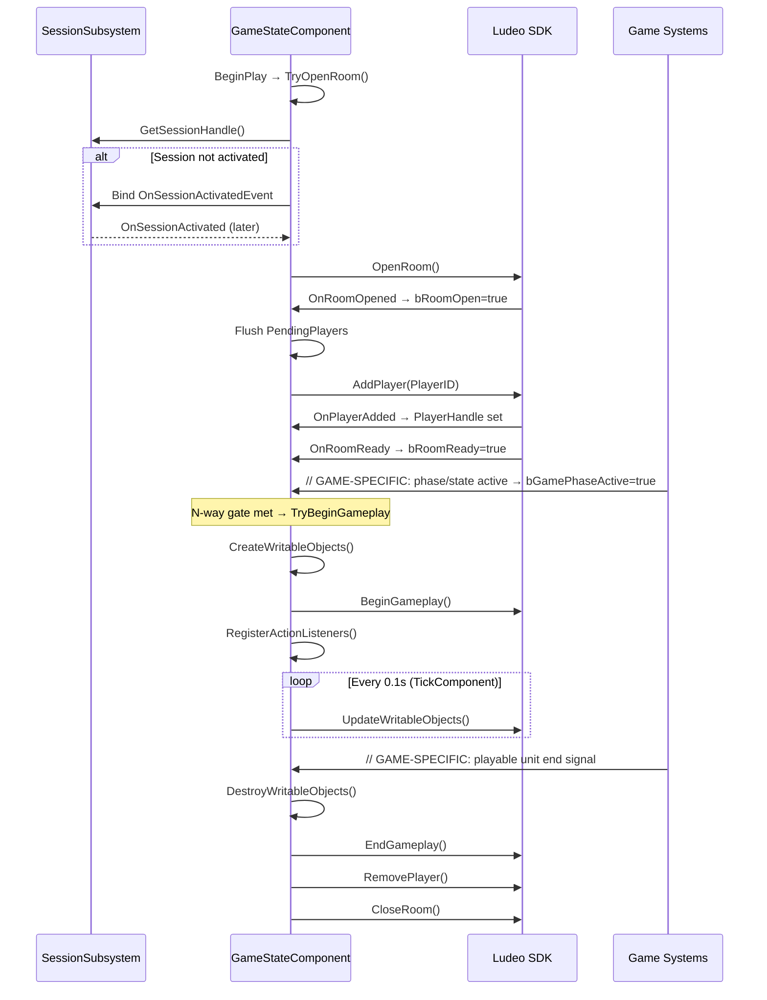

# Phase 02 — Lifecycle + Non-Gameplay

## 1. Goal / Purpose

Map SDK lifecycle points to the game's hook points, define the N-way gate for BeginGameplay, implement the plugin scaffold, and handle everything outside active gameplay — non-ludeoable map detection, pause/resume, map transitions, non-gameplay segment marking, back-to-menu, and mute. **Use template-driven approach** — the Subsystem + Component structure is universal across all UE games. Start from templates in `references/templates/`, substitute game-specific names and hook points.

The lifecycle is the foundation for all subsequent phases. Correctly identified and explicitly named **restoration entry point** (where Player Flow re-enters the lifecycle after map load) is part of this phase.

**Deliverables:**
- SDK lifecycle mapping (game event to SDK call for lifecycle points relevant to the curated slice)
- N-way gate conditions (all async signals required before BeginGameplay)
- TDD Section 2 (SDK Lifecycle)
- Plugin scaffold from templates (`.uplugin`, `.Build.cs`, module boilerplate, Subsystem, Component)
- Core game modifications (StaticLoadClass, delegate declarations, UE_API exports)
- Compile-fix until both plugin-disabled and plugin-enabled builds pass
- Frontend/non-ludeoable map detection (no room opens on menus/lobbies)
- Pause/resume handling (SDK callbacks + game pause integration)
- Non-gameplay segment marking (correct action names per Creator/Player Flow)
- Map transition handling (room lifecycle across travel)
- Back-to-menu and mute game callback handling
- Integrator-confirmed non-ludeoable map list

---

## 2. Inputs (Input Contract)

```
Required:
  tddSection1: markdown     — Approved Architecture TDD (.ludeo/tdd/integration-tdd.md Section 1)
  codeMap: json              — .ludeo/code-map.json (from Phase 1)
  integrationJson: json      — .ludeo/integration.json with saveSystemGroup, gameTitle, engineVersion, gameType

Optional:
  ludeoContext: MCP          — ludeo-context MCP server (if available)
  sdkDocs: MCP              — sdk-docs MCP server (for API verification)
```

Before starting this phase, verify:

- [ ] Phase 1 completed — `.ludeo/tdd/integration-tdd.md` Section 1 exists and is **human-approved**
- [ ] CODE_MAP available at `.ludeo/code-map.json`
- [ ] `integration.json` has `saveSystemGroup`, `gameTitle`, `engineVersion`, `gameType`
- [ ] LudeoUESDK plugin is accessible in the project (for header references)
- [ ] Game codebase compiles without Ludeo plugin

**From CODE_MAP (used throughout this phase):**
- `lifecycle_hooks` — all hook points discovered in Phase 1
- `core_classes` — GameMode, GameState, GameInstance, PlayerController
- `event_systems` — delegates, message subsystems, event buses
- `codebase_summary.usesGameFeatures` — determines plugin type (GameFeature vs regular)

---

## 3. Steps

Map each SDK lifecycle point to the game's actual code. Use CODE_MAP fields from Phase 1 as the starting point, then refine with targeted searches.

### 3.1 Startup & Shutdown

| SDK Lifecycle Point | What to Find | CODE_MAP Source | How to Verify |
|---|---|---|---|
| SDK Init (`FLudeoManager::Initialize`) | GameInstance initialization | `lifecycle_hooks.appStart` | Read the GameInstance class, confirm `Init()` or constructor |
| SDK Tick (`FLudeoManager::Tick`) | Per-frame tick mechanism | `lifecycle_hooks.appStart` | Confirm `FTSTicker` is available (engine version) |
| Session Create (`FLudeoSessionManager::CreateSession`) | Post-init, before activation | `lifecycle_hooks.appStart` | Same as SDK Init — happens in `Initialize()` |
| Session Activate (`FLudeoSession::Activate`) | Window handle availability | `lifecycle_hooks.appStart` | `Grep("FSlateApplication", glob: "*.cpp")` — check if game has custom window handling |
| Session Destroy / Finalize | App shutdown | `lifecycle_hooks.appStart` | Read GameInstance `Shutdown()` or `::Deinitialize()` pattern |

### 3.2 Room Lifecycle

**Room ≠ Highlight.** A room is a recording session that stays open for the entire gameplay session (one map/match). Multiple highlights can be captured within a single open room (player presses F9). Do NOT open/close rooms per highlight, per life, or per wave — one room per gameplay session.

> ### ⚠️ HARD RULE — open the room at LEVEL LOAD, never gate `OpenRoom` on a game phase
>
> `OpenRoom` + `AddPlayer` run as soon as the gameplay world is ready — in the component's
> `BeginPlay` (skip only non-ludeoable/frontend maps). **Do NOT defer `OpenRoom` until a warmup /
> countdown / "Playing" / "combat" / interesting-state condition.** Those gate **`BeginGameplay`
> only**, via the N-way gate (RoomReady + PlayerAdded + gameplay-phase-active).
>
> **Why this is load-bearing (not style):** in **Creator flow the platform delivers `OnRoomReady`
> ~1 ms after `AddPlayer` ONLY when the room opened in the normal level-load window.** A room opened
> late (e.g. seconds later, when the Playing phase starts) **never receives `OnRoomReady`** — the
> begin gate hangs, `Player::BeginGameplay` is never called, and **nothing records**, even though
> `OpenRoom`/`AddPlayer` both returned success. (Lyra Phase 2, log-verified.)
>
> Because the room opens before the player may have joined, drive `AddPlayer` off a **player-added
> delegate + a pending-players queue** (flush in `OnRoomOpened`) — do not synchronously resolve "the
> local player" at room-open time; they may not exist yet.
>
> **Diagnostic tell:** `OpenRoom`/`AddPlayer` succeed but no `Broadcasting RoomReady` line ever
> appears, AND `OpenRoom` happened many seconds after session activation. Suspect a late/phase-gated
> room open FIRST — do not force-begin (see `learnings/common-mistakes/never-force-begin-without-onroomready.md`),
> and do not blame the SDK version, the overlay `failed to parse gameplays.gameplay-ready` warning
> (a red herring), or backend config. Fix: move `OpenRoom` to `BeginPlay`. See
> `learnings/common-mistakes/open-creator-room-at-level-load-not-on-phase.md`.

| SDK Lifecycle Point | What to Find | CODE_MAP Source | How to Verify |
|---|---|---|---|
| Room Open (`FLudeoSession::OpenRoom`) | Start of playable unit | `lifecycle_hooks.roomOpen` | Trace from the hook to confirm it fires once per playable unit |
| AddPlayer (`FLudeoRoom::AddPlayer`) | Player spawn/join event | `core_classes` (GameState, PlayerState) | `Grep("OnPlayerState\|OnNewPlayer\|OnPlayerJoined\|PlayerAdded\|OnPlayerStatePawnSet\|SpawnDefaultPawnForPlayer", glob: "*.h")` |
| BeginGameplay gate conditions | Async signals that ALL must be true | `lifecycle_hooks.gameplayStart` + `event_systems` | List each condition and its callback source. **For gameplay tags:** verify exact tag strings — see 3.2.1 below |
| EndGameplay (`FLudeoPlayer::EndGameplay`) | Gameplay end signal | `lifecycle_hooks.gameplayEnd` | Confirm this fires once (not per-player in single-player) |
| RemovePlayer / CloseRoom | End of playable unit | `lifecycle_hooks.roomClose` | Confirm ordering: EndGameplay before RemovePlayer before CloseRoom |

#### 3.2.0 Verify Each Phase 1 Hook Has a LIVE Caller in the Slice Maps

Before scaffolding against a hook point identified in Phase 1, confirm something actually **calls** it in the curated slice — do not assume a method that exists is a method that runs. Phase 1 maps the code; Phase 2 must verify the wiring is live:

- For every hook method/delegate the plugin will bind to, find its caller. For BP-exposed hooks, scan BP callers (e.g. `bp_inspector` graph search, or grep the placed-actor/level-script bindings) — a `BlueprintCallable` "bridge" method with **no BP caller** is dead, and binding to it produces a gate that never fires (silent failure). See `learnings/common-mistakes/dead-bridge-methods-verify-bp-callers.md`.
- Confirm the GameMode/GameState class you're filtering on is actually the one instantiated on the slice maps. A project-wide default GameMode can shadow a per-map class and break a class-based world filter — see `learnings/architecture/global-default-gamemode-breaks-class-world-filter.md`.
- For phase/state gates, confirm which enum/value the game treats as "interactive gameplay" — see `learnings/architecture/toolkit-gamestate-phase-enum-is-the-gate.md`.

#### 3.2.1 Verify Exact Gameplay Tag Strings

Do NOT trust tag names from C++ header comments or class names. The actual tag string may be prefixed by the game feature namespace (e.g., `ShooterGame.GamePhase.Playing` instead of `GamePhase.Playing`).

To find the real tag values:

1. `Grep("UE_DEFINE_GAMEPLAY_TAG.*Phase", glob: "*.cpp")` across **all plugins** (not just the game module)
2. Check GameFeature plugin tag config files: `Glob("**/Config/Tags/*.ini")` and `Glob("**/Config/**GameplayTags*.ini")`
3. Check data assets: `Grep("GamePhase", glob: "*.ini")` in all plugin Config directories
4. **Most reliable:** Run the game once and grep the log for `Beginning Phase` or the phase subsystem's log category to see the exact tag string with its full qualified name

Record the exact tag string (with namespace prefix) in the TDD. A wrong tag string causes the game-phase gate condition to never become true, which means `BeginGameplay` never fires — a silent, hard-to-debug failure.

**Gameplay tag storage: use lazy init, NOT static const members.** Tags defined via `UE_DEFINE_GAMEPLAY_TAG` in game/plugin code may not be registered at static init time. Using `static const FGameplayTag MyTag = FGameplayTag::RequestGameplayTag(...)` in a header can fail silently (returns empty tag) if the tag table hasn't loaded yet. Instead, request the tag at the point of use:

```cpp
// WRONG — may resolve to empty tag at static init:
static const FGameplayTag GamePhaseTag = FGameplayTag::RequestGameplayTag(TEXT("ShooterGame.GamePhase.Playing"));

// CORRECT — lazy init, resolves at call time when tag table is ready:
FGameplayTag GetGamePhasePlayingTag()
{
    static FGameplayTag Tag = FGameplayTag::RequestGameplayTag(TEXT("ShooterGame.GamePhase.Playing"));
    return Tag;
}
// Or: use UE_DEFINE_GAMEPLAY_TAG_STATIC in the .cpp file (not the header)
```

### 3.3 Player Flow Entry (Restoration Entry Point)

This is where Player Flow re-enters the lifecycle after a `ServerTravel` to the curated slice map. The component checks `Subsystem->GetPendingLudeoID()` in `BeginPlay` to determine whether to open a Creator room or a Player Flow room. The entry points that feed into this check:

| What to Find | How | Record In |
|---|---|---|
| Console command registration | `Grep("IConsoleManager\|RegisterConsoleCommand\|IConsoleCommand", glob: "*.cpp")` — verify pattern used by the game | findings |
| Launch argument parsing | `Grep("FParse::Value\|FCommandLine::Get", glob: "*.cpp")` — check game's arg parsing pattern | findings |
| ServerTravel pattern | `Grep("ServerTravel\|OpenLevel", glob: "*.cpp")` — how does the game change maps? | `lifecycle_hooks.mapTransition` |
| Travel URL parameters | Read ServerTravel callsites — does the game use URL options (`?Param=Value`)? | findings |

**Restoration entry point — explicit definition:** After map load, the `ULudeoGameStateComponent::BeginPlay()` checks `Subsystem->GetPendingLudeoID()`. If set, it calls `OpenRoomForPlayerFlow()` (pauses game, opens room with LudeoID, waits for RoomReady, then calls `ApplyPlayerState()` after `BeginGameplay` and resumes). If not set, it calls `OpenRoom()` (Creator Flow). This check in `TryOpenRoom()` is the canonical restoration entry point.

### 3.4 Non-Gameplay Handling

#### 3.4.1 Non-Ludeoable Maps

Identify maps where a Ludeo room should NOT be opened (menus, lobbies, loading screens, cinematics-only maps).

| What | How |
|------|-----|
| Frontend/menu maps | `Grep("(MainMenu\|FrontEnd\|Lobby\|Title\|Loading)", glob: "*.umap")` in Content/ |
| Map list in config | `Grep("(MapList\|MapRotation\|FrontEndMap\|MainMenuMap\|TransitionMap)", glob: "*.ini")` |
| GameMode per map | `Grep("(GameModeName\|DefaultGameMode\|/Game/.*GameMode)", glob: "*.ini")` — menu maps often use a distinct GameMode |
| Level references in code | `Grep("(OpenLevel\|ServerTravel\|ClientTravel).*\"", glob: "*.cpp")` — find all map travel targets |

**Detection approaches (pick one based on game architecture):**

| Approach | When to Use | Implementation |
|----------|-------------|----------------|
| Map name matching | Simple games with fixed map names | Config-driven list in plugin settings |
| GameMode class check | Games with distinct menu vs gameplay GameModes | `GetWorld()->GetAuthGameMode()->IsA<AMenuGameMode>()` |
| Experience/GameFeature tag | Lyra-style games with experience system | Check active experience for gameplay tag |

#### 3.4.2 Pause & Frontend Detection

| What to Find | How | Record In |
|---|---|---|
| Pause mechanism | `Grep("SetGamePaused\|IsPaused\|GetWorld.*IsPaused\|bGamePaused\|NumObservedPausers", glob: "*.cpp")` — if standard pause not found, check for custom pause tracking in experience/session managers, time dilation, CommonUI pause layers | **`integration.json → pauseMechanism`** — record as `{"type": "SetGamePaused" | "PlayerController::SetPause" | "custom", "function": "<full call>", "notes": "<any caveats>"}`. The SDK's `OnPauseGameRequested` callback must use this mechanism. |
| Frontend / menu maps | `Grep("FrontEnd\|MainMenu\|LobbyMap\|MenuLevel\|EntryMap", glob: "*.cpp")` + check `DefaultEngine.ini` for `GameDefaultMap` | findings |
| Non-ludeoable detection | Identify how to distinguish menu maps from gameplay maps — config, map name prefix, GameMode class? | decisions |
| Map transition handling | `Grep("SeamlessTravel\|ServerTravel\|LoadStreamLevel", glob: "*.cpp")` — does the game use seamless travel? | `lifecycle_hooks.mapTransition` |

**Pause Mechanism Discovery Guide:**

| What you find | Mechanism | What to record | Caveats |
|---------------|-----------|----------------|---------|
| Game code calls `UGameplayStatics::SetGamePaused()` | Standard UE pause | `type: "SetGamePaused"` | Simplest path. Works for single-player and listen-server. |
| Game code calls `APlayerController::SetPause()` directly | Controller-level pause | `type: "PlayerController::SetPause"` | Can be rejected by game mode's `CanUnpause` delegate. Check if the game has `CanUnpause` overrides. |
| Game has a custom pause manager (e.g., `UPauseManager`, `UGameFlowSubsystem::Pause`) | Custom manager | `type: "custom", function: "<full call path>"` | Must use the game's manager — calling `SetGamePaused` directly may bypass their state tracking. |
| Game uses time dilation instead of engine pause (common in multiplayer — e.g., Lyra) | Time dilation | `type: "custom", function: "SetTimeDilation(0.0)"` | `GetWorld()->IsPaused()` returns false — tick polling in Phase 4 must check dilation instead. Record in notes. |
| Game uses CommonUI pause layers (`UCommonActivatableWidget::SetBindVisibilities`) | UI-driven pause | `type: "custom"` | Pause state is driven by widget visibility, not a direct pause call. Integration must detect the widget state. |
| No pause mechanism found at all | No existing pause | `type: "SetGamePaused"` (use default) | The game may not have pause support yet. `SetGamePaused` is the safe default. |

**If the mechanism is ambiguous** (multiple pause systems coexist, or you're unsure which one the game uses for "real" gameplay pause), ask the human using question 8 below. Don't guess — a wrong pause call can be silently rejected or bypass the game's state tracking.

**If the game uses time dilation instead of engine pause**, note this in `integration.json → pauseMechanism.notes` — it affects Phase 4's tick polling: `GetWorld()->IsPaused()` won't detect time-dilation-based pause. The component must poll `GetWorld()->GetWorldSettings()->TimeDilation` instead.

#### 3.4.3 Non-Gameplay Segments During Matches

Some games have non-gameplay periods within a match (warmup, scoreboard, cinematics, loading between rounds):

| What | How |
|------|-----|
| Warmup/countdown | `Grep("(WarmupTime\|bInWarmup\|CountdownTimer\|PreMatch\|WaitingToStart)", glob: "*.h")` |
| Scoreboard/results | `Grep("(Scoreboard\|ShowResults\|PostMatch\|MatchEnd\|VictoryScreen)", glob: "*.h")` |
| Cinematics/cutscenes | `Grep("(LevelSequence\|Matinee\|Cutscene\|Cinematic\|bInCinematic)", glob: "*.h")` |
| Round transitions | `Grep("(RoundEnd\|NextRound\|RoundTransition\|IntermissionTime)", glob: "*.h")` |

#### 3.4.4 Map Transition Pattern

| What | How |
|------|-----|
| ServerTravel (hard) | `Grep("ServerTravel", glob: "*.cpp")` |
| SeamlessTravel | `Grep("(SeamlessTravel\|bUseSeamlessTravel)", glob: "*.cpp")` |
| OpenLevel | `Grep("UGameplayStatics::OpenLevel", glob: "*.cpp")` |
| Level streaming | `Grep("(LoadStreamLevel\|ULevelStreamingDynamic\|StreamingLevel)", glob: "*.cpp")` |
| TransitionMap config | `Grep("TransitionMap", glob: "*.ini")` |

### 3.5 Teardown Coordination

| What to Find | How | Record In |
|---|---|---|
| Mid-game exit | `Grep("ReturnToMainMenu\|BackToMenu\|QuitToMenu\|DisconnectFromMatch", glob: "*.cpp")` | findings |
| Existing cleanup chains | Read the GameMode/GameState end-of-match flow — does it clean up in a specific order? | findings |
| Level transition cleanup | Does BeginPlay/EndPlay fire reliably on GameState during map changes? | findings |

### 3.6 API Export Verification (HARD GATE — Produces Artifact)

For every game class method the plugin will call, verify it has the module's API export macro (e.g., `LYRAGAME_API`, `GAMENAME_API`). Methods without the export macro will cause **unresolved external symbol** linker errors when called from the plugin DLL.

| What to Check | How | Record In |
|---|---|---|
| Game class export macros | For each class in CODE_MAP `core_classes`, check if the class declaration has `GAMENAME_API` | coreGameMods |
| Specific methods the plugin needs | For each hook point the plugin will call or delegate it will bind, verify the method/delegate is exported | coreGameMods |
| Missing exports | Add to the Core Game Modifications table — these are changes needed in game code before the plugin can compile | coreGameMods |

**HARD GATE: Write `.ludeo/export-check.md` before proceeding to Section 7 (Implementation).** This artifact must list every cross-module method/delegate the plugin will use, whether it's exported, and what action is needed:

```markdown
# Export Verification — {GameName}

| Class | Method/Delegate | Has API Macro? | Action Needed |
|-------|----------------|----------------|---------------|
| AMyGameState | OnMatchStarted | YES | None |
| AMyGameMode | GetCurrentPhase() | NO | Add GAMENAME_API to declaration |
```

Do NOT proceed to implementation until this file exists and all missing exports are identified.

---

### 3.7 Implementation — Pre-Flight Checklist

### STOP — Pre-Flight Checklist

Before writing any code, confirm ALL of the following:

- [ ] `.ludeo/export-check.md` exists — every cross-module method has `GAMENAME_API`? (Section 3.6 output)
- [ ] Exact gameplay tag strings verified against actual tag definitions, not header comments? (Section 3.2.1 output)
- [ ] `.Build.cs` has all required module dependencies listed?
- [ ] Template variables populated from CODE_MAP? (see `references/templates/plugin-scaffold-guide.md`)
- [ ] `Source/` directory exists in the game repo. If NOT, the project is BP-only — flag it and note that Phase 2 must plan for a minimal game module OR a target-generating plugin (e.g., CommonUI) before the packaging smoke test (Section 3.18) can pass. Record the chosen approach in TDD.
- [ ] Target name confirmed — read `Source/*.Target.cs` filenames (excluding `*Editor.Target.cs` / `*Server.Target.cs`) and verify a non-Editor game target exists. This is the target `BuildAndPackage.bat` and Section 3.18 Tier 1 will use. For BP-only projects, document the fallback target name strategy (from the module/plugin decision above).
- [ ] `.ludeo/tools/BuildAndPackage.bat` is present and executable. If missing, copy from the skill's `tools/` directory before starting implementation — it is required for Section 3.18 Tier 2.

If any item is unchecked, go back and complete it before writing code.

### 3.8 Implementation — Build SDK Plugin Standalone First

**Build the SDK plugin alone first.** Before scaffolding the integration plugin, build the `LudeoUESDK` module on its own against the project's engine version and confirm it compiles and links. Acquiring a release zip does not guarantee it builds on this engine — a release asset may target a different engine version and need adjustment (e.g. `WhitelistPlatforms` → `PlatformAllowList`, loading-phase changes). Building it standalone surfaces any engine-API drift immediately, instead of burying it inside a long compile-fix loop after you have already scaffolded code on top. Only proceed to scaffold `LudeoIntegration` once the base SDK plugin builds clean. See `learnings/common-mistakes/build-sdk-plugin-standalone-first.md`.

### 3.9 Implementation — Plugin Scaffold

The plugin type depends on Phase 1 findings. Check `codeMap.codebase_summary.usesGameFeatures`:

#### GameFeature Plugin (if game uses GameFeatures)

**Directory structure:**

```
Plugins/GameFeatures/LudeoIntegration/
├── LudeoIntegration.uplugin
└── Source/
    └── LudeoIntegrationRuntime/
        ├── LudeoIntegrationRuntime.Build.cs
        ├── Public/
        │   ├── LudeoIntegrationRuntimeModule.h
        │   ├── LudeoSessionSubsystem.h
        │   └── LudeoGameStateComponent.h
        └── Private/
            ├── LudeoIntegrationRuntimeModule.cpp
            ├── LudeoSessionSubsystem.cpp
            └── LudeoGameStateComponent.cpp
```

**.uplugin template (REQUIRED — do not replace these fields with alternatives unless verified in the current project):**

The following fields are load-bearing. Changing them (especially `CanContainContent`) will break the plugin:

```json
{
    "FileVersion": 3,
    "Version": 1,
    "VersionName": "1.0",
    "FriendlyName": "Ludeo Integration",
    "Description": "Ludeo SDK integration for [GameTitle]",
    "Category": "Game Features",
    "CreatedBy": "Ludeo",
    "CanContainContent": false,   // ← REQUIRED: `false` for code-only plugins. Do not copy from game plugins which typically have content.
    "BuiltInInitialFeatureState": "Active",
    "ExplicitlyLoaded": false,
    "Plugins": [
        {
            "Name": "LudeoUESDK",
            "Enabled": true
        }
    ],
    "Modules": [
        {
            "Name": "LudeoIntegrationRuntime",
            "Type": "Runtime",
            "LoadingPhase": "Default"
        }
    ]
}
```

#### Regular Plugin (if game does not use GameFeatures)

**Directory structure:**

```
Plugins/LudeoIntegration/
├── LudeoIntegration.uplugin
└── Source/
    └── LudeoIntegrationRuntime/
        ├── LudeoIntegrationRuntime.Build.cs
        ├── Public/
        │   ├── LudeoIntegrationRuntimeModule.h
        │   ├── LudeoSessionSubsystem.h
        │   └── LudeoGameStateComponent.h
        └── Private/
            ├── LudeoIntegrationRuntimeModule.cpp
            ├── LudeoSessionSubsystem.cpp
            └── LudeoGameStateComponent.cpp
```

**.uplugin template (REQUIRED — same field rules as GameFeature variant above):**

```json
{
    "FileVersion": 3,
    "Version": 1,
    "VersionName": "1.0",
    "FriendlyName": "Ludeo Integration",
    "Description": "Ludeo SDK integration for [GameTitle]",
    "Category": "Gameplay",
    "CreatedBy": "Ludeo",
    "CanContainContent": false,   // ← REQUIRED: `false` for code-only plugins. Do not copy from game plugins which typically have content.
    "Plugins": [
        {
            "Name": "LudeoUESDK",
            "Enabled": true
        }
    ],
    "Modules": [
        {
            "Name": "LudeoIntegrationRuntime",
            "Type": "Runtime",
            "LoadingPhase": "Default"
        }
    ]
}
```

### 3.10 Implementation — Build.cs Template

```csharp
using UnrealBuildTool;

public class LudeoIntegrationRuntime : ModuleRules
{
    public LudeoIntegrationRuntime(ReadOnlyTargetRules Target) : base(Target)
    {
        PCHUsage = PCHUsageMode.UseExplicitOrSharedPCHs;

        PublicDependencyModuleNames.AddRange(new string[]
        {
            "Core",
            "CoreUObject",
            "Engine",
            "ModularGameplay",    // For UGameStateComponent
            "LudeoUESDK",         // Ludeo SDK wrapper
        });

        PrivateDependencyModuleNames.AddRange(new string[]
        {
            "Slate",
            "SlateCore",          // For FSlateApplication (deferred activation)
            // GAME-SPECIFIC: Add game module name for accessing game classes
            // e.g., "GameName",
        });
    }
}
```

### 3.11 Implementation — Module Boilerplate

**LudeoIntegrationRuntimeModule.h:**

```cpp
#pragma once

#include "Modules/ModuleManager.h"

class FLudeoIntegrationRuntimeModule : public IModuleInterface
{
public:
    virtual void StartupModule() override;
    virtual void ShutdownModule() override;
};
```

**LudeoIntegrationRuntimeModule.cpp:**

```cpp
#include "LudeoIntegrationRuntimeModule.h"

#define LOCTEXT_NAMESPACE "FLudeoIntegrationRuntimeModule"

void FLudeoIntegrationRuntimeModule::StartupModule()
{
}

void FLudeoIntegrationRuntimeModule::ShutdownModule()
{
}

#undef LOCTEXT_NAMESPACE

IMPLEMENT_MODULE(FLudeoIntegrationRuntimeModule, LudeoIntegrationRuntime)
```

### 3.12 Implementation — First Build Probe

Before writing full class implementations, verify the plugin scaffold compiles:

1. Create the `.uplugin`, `.Build.cs`, module boilerplate from templates above
2. Create empty class shells — `UCLASS` with `GENERATED_BODY()` only, no methods:
   ```cpp
   // LudeoSessionSubsystem.h — minimal shell
   #pragma once
   #include "Subsystems/GameInstanceSubsystem.h"
   #include "LudeoSessionSubsystem.generated.h"

   UCLASS()
   class ULudeoSessionSubsystem : public UGameInstanceSubsystem
   {
       GENERATED_BODY()
   };
   ```
3. Enable the plugin in the game's `.uproject` Plugins array
4. Build — this catches UHT config issues (e.g., `NativePointerMemberBehavior`), module dependency problems, and include path issues before any real code is written
5. Fix any issues that arise
6. Only then proceed to writing full class skeletons below

This step prevents wasting time writing hundreds of lines of code that won't compile due to scaffolding issues.

### 3.13 Implementation — Header Validation Checklist

Before writing `.cpp` files, validate each `.h` file:

- [ ] Every type in method signatures → `#include`d or forward-declared in the `.h`?
- [ ] Every `UPROPERTY` pointer → `TObjectPtr<T>` not raw `T*`? (required in UE 5.x)
- [ ] Every delegate type → full `#include`, not just forward declaration?
- [ ] Every `FDelegateHandle` → correct scoped type for the context?
- [ ] `GENERATED_BODY()` present in every `UCLASS`/`USTRUCT`?
- [ ] Module API export macro on classes that need cross-module access?

### 3.14 Implementation — Class Skeletons

**ULudeoSessionSubsystem** — all methods present, SDK calls in place, game-specific hooks marked:

```cpp
// === LudeoSessionSubsystem.h ===
#pragma once

#include "Subsystems/GameInstanceSubsystem.h"
#include "LudeoSessionSubsystem.generated.h"

DECLARE_DYNAMIC_MULTICAST_DELEGATE(FOnLudeoSessionActivatedEvent);
DECLARE_DELEGATE_OneParam(FOnRoomTeardownComplete, bool /*bSuccess*/);

USTRUCT()
struct FLudeoPlayerInitialState
{
    GENERATED_BODY()
    FVector Position = FVector::ZeroVector;
    FRotator Rotation = FRotator::ZeroRotator;
    FRotator ControlRotation = FRotator::ZeroRotator;
    float Health = 0.f;
    int32 TeamID = INDEX_NONE;
    TArray<FString> WeaponAssetPaths;
    int32 ActiveWeaponIndex = 0;
};

USTRUCT()
struct FLudeoBotInitialState
{
    GENERATED_BODY()
    FVector Position = FVector::ZeroVector;
    FRotator Rotation = FRotator::ZeroRotator;
    float Health = 0.f;
    int32 TeamID = INDEX_NONE;
    TArray<FString> WeaponAssetPaths;
};

UCLASS()
class ULudeoSessionSubsystem : public UGameInstanceSubsystem
{
    GENERATED_BODY()

public:
    virtual void Initialize(FSubsystemCollectionBase& Collection) override;
    virtual void Deinitialize() override;

    bool IsSessionActivated() const { return bSessionActivated; }
    const TOptional<FLudeoSessionHandle>& GetSessionHandle() const { return SessionHandle; }

    const FString& GetPendingLudeoID() const { return PendingLudeoID; }
    void ClearPendingLudeoID() { PendingLudeoID.Empty(); }
    const FLudeoPlayerInitialState& GetPendingPlayerState() const { return PendingPlayerState; }
    void ClearPendingPlayerState() { PendingPlayerState = FLudeoPlayerInitialState(); }
    const TArray<FLudeoBotInitialState>& GetPendingBotStates() const { return PendingBotStates; }
    void ClearPendingBotStates() { PendingBotStates.Empty(); }

    void PlayLudeo(const FString& LudeoID);

    /** Detached teardown — called from the component's EndPlay on game-initiated travel.
     *  The subsystem (whose lifetime exceeds the world) completes the chain with its OWN
     *  delegates so it survives the component's destruction. See Section 5.6. */
    void FinishRoomTeardownDetached(FLudeoRoomHandle RoomHandle, TOptional<FLudeoPlayerHandle> PlayerHandle,
        const FString& PlayerID, bool bGameplayStarted);

    UPROPERTY(BlueprintAssignable)
    FOnLudeoSessionActivatedEvent OnSessionActivatedEvent;

private:
    void ActivateSession();
    bool TryActivateSession(float DeltaTime);
    void CheckCommandLineLudeo();
    void FetchAndTravelToLudeo(const FString& LudeoID);
    void OnGetLudeo(FLudeoResult Result, FLudeoHandle LudeoHandle);
    class ULudeoGameStateComponent* FindActiveGameStateComponent() const;
    void TravelToFrontEnd();
    void OnTeardownComplete(bool bSuccess);

    // SDK notification handlers
    void OnLudeoSelected(const FString& LudeoID);
    void OnPauseGameRequested();
    void OnResumeGameRequested();
    void OnGameBackToMainMenuRequested();
    void OnPlayerConsentUpdated(bool bCanCreate, bool bCanPlay);
    void OnLocalizationUpdated();
    void OnMuteGameRequested(bool bMute);
    void OnSDKOutOfBand();

    bool bSessionActivated = false;
    TOptional<FLudeoSessionHandle> SessionHandle;
    FDelegateHandle SDKTickerHandle;
    FDelegateHandle DeferredActivationTickerHandle;

    FString ValidatingLudeoID;   // selection under validation; promoted to PendingLudeoID on GetLudeo success
    FString PendingLudeoID;       // set ONLY after OnGetLudeo succeeds — gates Player Flow on next map load
    FLudeoPlayerInitialState PendingPlayerState;
    TArray<FLudeoBotInitialState> PendingBotStates;

    // Teardown coordination — teardown runs AFTER a selection validates (see PlayLudeo)
    enum class EPendingAction { None, PlayLudeo, BackToMenu };
    EPendingAction PendingAction = EPendingAction::None;
};
```

```cpp
// === LudeoSessionSubsystem.cpp (skeleton) ===
#include "LudeoSessionSubsystem.h"
#include "LudeoGameStateComponent.h"
// GAME-SPECIFIC: #include game headers as needed

void ULudeoSessionSubsystem::Initialize(FSubsystemCollectionBase& Collection)
{
    Super::Initialize(Collection);

    // Step 1: Initialize SDK
    FLudeoManager& Manager = FLudeoManager::GetInstance();
    Manager.Initialize();

    // Step 2: Register per-frame tick
    SDKTickerHandle = FTSTicker::GetCoreTicker().AddTicker(
        FTickerDelegate::CreateLambda([](float DeltaTime) -> bool
        {
            FLudeoManager::GetInstance().Tick(DeltaTime);
            return true;
        })
    );

    // Step 3: Create session
    FLudeoSessionManager::CreateSession(/* params */);

    // Step 4: Register notification callbacks (ALL before Activate)
    // FLudeoSession* Session = ...;
    // Session->GetOnLudeoSelectedDelegate().AddUObject(this, &ThisClass::OnLudeoSelected);
    // Session->GetOnPauseGameRequestedDelegate().AddUObject(this, &ThisClass::OnPauseGameRequested);
    // Session->GetOnResumeGameRequestedDelegate().AddUObject(this, &ThisClass::OnResumeGameRequested);
    // Session->GetOnGameBackToMenuRequestedDelegate().AddUObject(this, &ThisClass::OnGameBackToMainMenuRequested);
    // Session->GetOnPlayerConsentUpdatedDelegate().AddUObject(this, &ThisClass::OnPlayerConsentUpdated);
    // Session->GetOnLocalizationUpdatedDelegate().AddUObject(this, &ThisClass::OnLocalizationUpdated);
    // Session->GetOnMuteGameRequestedDelegate().AddUObject(this, &ThisClass::OnMuteGameRequested);
    // Session->GetOnRoomReadyDelegate().AddUObject(...); // bound on component
    // Session->GetOnSDKOutOfBandDelegate().AddUObject(this, &ThisClass::OnSDKOutOfBand);

    // Step 5: Register console command
    // IConsoleManager::Get().RegisterConsoleCommand(TEXT("Ludeo.Play"), ...);

    // Step 6: Activate session (deferred if no window)
    ActivateSession();
}

void ULudeoSessionSubsystem::Deinitialize()
{
    // Remove deferred activation ticker
    if (DeferredActivationTickerHandle.IsValid())
    {
        FTSTicker::GetCoreTicker().RemoveTicker(DeferredActivationTickerHandle);
    }

    // Destroy session
    if (SessionHandle.IsSet())
    {
        FLudeoSessionManager::DestroySession(SessionHandle.GetValue());
    }

    // Remove SDK ticker
    FTSTicker::GetCoreTicker().RemoveTicker(SDKTickerHandle);

    // Finalize SDK
    FLudeoManager::GetInstance().Finalize();

    Super::Deinitialize();
}

// See Section 5.3 for the complete ActivateSession() implementation.
// The skeleton here is IDENTICAL to Section 5.3 — do not diverge.
// Copy the full method from Section 5.3 when generating implementation code.

bool ULudeoSessionSubsystem::TryActivateSession(float DeltaTime)
{
    TSharedPtr<SWindow> Window = FSlateApplication::Get().GetActiveTopLevelWindow();
    if (!Window.IsValid()) return true; // keep ticking

    DeferredActivationTickerHandle.Reset();
    ActivateSession();
    return false; // stop ticking
}

void ULudeoSessionSubsystem::PlayLudeo(const FString& LudeoID)
{
    // VALIDATE FIRST, DISTURB SECOND. GetLudeo (inside FetchAndTravelToLudeo) is read-only.
    // Do NOT tear the active room down here — if the selection is foreign / stale / from another
    // map, OnGetLudeo fails and we must leave the running session exactly as it was (a no-op).
    // Teardown happens only AFTER OnGetLudeo succeeds, before ServerTravel.
    ValidatingLudeoID = LudeoID;   // held separately; promoted to PendingLudeoID only on success
    FetchAndTravelToLudeo(LudeoID);
}

// FetchAndTravelToLudeo(LudeoID): FLudeoSession::GetLudeo(LudeoID) → OnGetLudeo.
//
// OnGetLudeo(Result, Handle):
//   if (!Result.IsSuccessful() || !MapSliceSupported(Handle)) { log + return; }   // no-op, session intact
//   Read GameMetadata + Player + Bot objects into Pending* fields.
//   PendingLudeoID = ValidatingLudeoID;          // promote ONLY now — OnGetLudeo carries no id
//   FLudeoSession::ReleaseLudeo(Handle);
//   ULudeoGameStateComponent* Comp = FindActiveGameStateComponent();
//   if (Comp && Comp->IsRoomActive()) {
//       PendingAction = EPendingAction::PlayLudeo; // OnTeardownComplete will ServerTravel
//       Comp->TeardownRoom(FOnRoomTeardownComplete::CreateUObject(this, &ThisClass::OnTeardownComplete));
//   } else {
//       ServerTravel(MapName?Options...);
//   }

void ULudeoSessionSubsystem::CheckCommandLineLudeo()
{
    FString LudeoID;
    if (FParse::Value(FCommandLine::Get(), TEXT("-LudeoID="), LudeoID))
    {
        PlayLudeo(LudeoID);
    }
}

// ... remaining handlers follow the same pattern
```

**ULudeoGameStateComponent:**

```cpp
// === LudeoGameStateComponent.h ===
#pragma once

#include "Components/GameStateComponent.h"
#include "LudeoGameStateComponent.generated.h"

UCLASS()
class ULudeoGameStateComponent : public UGameStateComponent
{
    GENERATED_BODY()

public:
    ULudeoGameStateComponent(const FObjectInitializer& ObjectInitializer);

    virtual void BeginPlay() override;
    virtual void EndPlay(const EEndPlayReason::Type EndPlayReason) override;
    virtual void TickComponent(float DeltaTime, ELevelTick TickType,
        FActorComponentTickFunction* ThisTickFunction) override;

    bool IsRoomActive() const { return bRoomOpen || bRoomRequested; }
    void TeardownRoom(FOnRoomTeardownComplete OnComplete);

private:
    // Room lifecycle
    void TryOpenRoom();
    void OpenRoom();
    void OpenRoomForPlayerFlow();
    void OnRoomOpened(FLudeoResult Result);
    void OnRoomReady();
    void AddPlayerToRoom();
    void OnPlayerAdded(FLudeoResult Result, FLudeoPlayerHandle Handle);
    void TryBeginGameplay();
    void EndGameplay();
    void OnEndGameplayComplete(FLudeoResult Result);
    void RemovePlayerFromRoom();
    void OnPlayerRemoved(FLudeoResult Result);
    void CloseRoom();
    void OnRoomClosed(FLudeoResult Result);
    void InvokeTeardownCallback();

    // State tracking stubs (filled in Phase 5+)
    void CreateWritableObjects();
    void UpdateWritableObjects();
    void DestroyWritableObjects();
    void RegisterActionListeners();
    void UnregisterActionListeners();

    // Player Flow stubs (filled in Phase 5+)
    void ApplyPlayerState();
    void ApplyBotStates();

    // N-way gate conditions
    bool bRoomOpen = false;
    bool bRoomReady = false;
    bool bRoomRequested = false;
    bool bGameplayStarted = false;
    bool bGamePhaseActive = false;
    TOptional<FLudeoPlayerHandle> PlayerHandle;
    TOptional<FLudeoRoomHandle> RoomHandle;
    FString CurrentPlayerID;   // player id used for AddPlayer/RemovePlayer — needed by detached teardown

    // GAME-SPECIFIC: Gameplay phase tag — use lazy init helper, NOT static const member.
    // See Section 3.2.1 for why. Replace tag string with actual verified value.
    // static FGameplayTag GetGamePhasePlayingTag()
    // {
    //     static FGameplayTag Tag = FGameplayTag::RequestGameplayTag(TEXT("REPLACE.WITH.VERIFIED.TAG"));
    //     return Tag;
    // }

    // Teardown
    FOnRoomTeardownComplete TeardownCallback;

    // Tick throttle
    float WriteInterval = 0.1f;
    float TimeSinceLastWrite = 0.f;
};
```

```cpp
// === LudeoGameStateComponent.cpp (skeleton) ===
#include "LudeoGameStateComponent.h"
#include "LudeoSessionSubsystem.h"
// GAME-SPECIFIC: #include game headers as needed

ULudeoGameStateComponent::ULudeoGameStateComponent(const FObjectInitializer& ObjectInitializer)
    : Super(ObjectInitializer)
{
    PrimaryComponentTick.bCanEverTick = true;
    PrimaryComponentTick.bStartWithTickEnabled = true;
}

void ULudeoGameStateComponent::BeginPlay()
{
    Super::BeginPlay();

    // GAME-SPECIFIC: Check if this is a frontend/menu map — skip if so
    // if (IsFrontendMap()) return;

    ULudeoSessionSubsystem* Subsystem = GetGameInstance()->GetSubsystem<ULudeoSessionSubsystem>();
    if (!Subsystem) return;

    if (Subsystem->IsSessionActivated())
    {
        TryOpenRoom();
    }
    else
    {
        // Defer until session is activated
        Subsystem->OnSessionActivatedEvent.AddDynamic(this, &ThisClass::TryOpenRoom);
    }
}

void ULudeoGameStateComponent::EndPlay(const EEndPlayReason::Type EndPlayReason)
{
    // Game-initiated travel destroys this component THIS frame. Do NOT run the async
    // teardown chain from here — its completion delegates would bind to a dead component
    // and self-cancel, leaking the room and breaking OnRoomReady on the next room.
    // Hand the chain to the subsystem (lifetime exceeds the world). See Section 5.6.
    if (IsRoomActive() && RoomHandle.IsSet())
    {
        if (ULudeoSessionSubsystem* Subsystem = GetGameInstance() ? GetGameInstance()->GetSubsystem<ULudeoSessionSubsystem>() : nullptr)
        {
            // Phase 5+: clear any writable-object map here — CloseRoom releases room-owned objects (no per-object destroys)
            Subsystem->FinishRoomTeardownDetached(RoomHandle.GetValue(), PlayerHandle, CurrentPlayerID, bGameplayStarted);
        }
        // clear local state — the subsystem now owns completion
        bGameplayStarted = false;
        bRoomOpen = bRoomReady = bRoomRequested = false;
        PlayerHandle.Reset();
        RoomHandle.Reset();
    }

    Super::EndPlay(EndPlayReason);
}

void ULudeoGameStateComponent::TickComponent(float DeltaTime, ELevelTick TickType,
    FActorComponentTickFunction* ThisTickFunction)
{
    Super::TickComponent(DeltaTime, TickType, ThisTickFunction);

    if (!bGameplayStarted) return;

    // Throttle writes to 10Hz
    TimeSinceLastWrite += DeltaTime;
    if (TimeSinceLastWrite >= WriteInterval)
    {
        TimeSinceLastWrite = 0.f;
        UpdateWritableObjects(); // stub — filled in Phase 5+
    }

    // GAME-SPECIFIC: detect pause state transitions for Pause/Resume actions
}

void ULudeoGameStateComponent::TryOpenRoom()
{
    ULudeoSessionSubsystem* Subsystem = GetGameInstance()->GetSubsystem<ULudeoSessionSubsystem>();
    if (!Subsystem || !Subsystem->IsSessionActivated()) return;

    if (!Subsystem->GetPendingLudeoID().IsEmpty())
    {
        OpenRoomForPlayerFlow();
    }
    else
    {
        OpenRoom();
    }
}

void ULudeoGameStateComponent::TryBeginGameplay()
{
    if (bGameplayStarted) return;
    if (!bRoomReady) return;
    if (!PlayerHandle.IsSet()) return;
    if (!bGamePhaseActive) return;
    // GAME-SPECIFIC: add more conditions as discovered

    bGameplayStarted = true;
    CreateWritableObjects();
    FLudeoPlayer::BeginGameplay(PlayerHandle.GetValue());
    RegisterActionListeners();
}

void ULudeoGameStateComponent::EndGameplay()
{
    if (!bGameplayStarted) return;
    bGameplayStarted = false;

    DestroyWritableObjects();
    UnregisterActionListeners();

    FLudeoPlayer::EndGameplay(PlayerHandle.GetValue(),
        FLudeoPlayerEndGameplayDelegate::CreateUObject(this, &ThisClass::OnEndGameplayComplete));
}

void ULudeoGameStateComponent::TeardownRoom(FOnRoomTeardownComplete OnComplete)
{
    TeardownCallback = OnComplete;
    if (bGameplayStarted)
    {
        EndGameplay(); // triggers chain: EndGameplay → RemovePlayer → CloseRoom → InvokeCallback
    }
    else if (bRoomOpen)
    {
        CloseRoom();
    }
    else
    {
        InvokeTeardownCallback();
    }
}

// ... remaining chain methods (OnEndGameplayComplete → RemovePlayerFromRoom → OnPlayerRemoved → CloseRoom → OnRoomClosed → InvokeTeardownCallback)
// See Section 5.6 for the full teardown chain pattern

// Stubs for future phases
void ULudeoGameStateComponent::CreateWritableObjects() { /* Phase 5+ */ }
void ULudeoGameStateComponent::UpdateWritableObjects() { /* Phase 5+ */ }
void ULudeoGameStateComponent::DestroyWritableObjects() { /* Phase 5+ */ }
void ULudeoGameStateComponent::RegisterActionListeners() { /* Phase 5+ */ }
void ULudeoGameStateComponent::UnregisterActionListeners() { /* Phase 5+ */ }
void ULudeoGameStateComponent::ApplyPlayerState() { /* Phase 5+ */ }
void ULudeoGameStateComponent::ApplyBotStates() { /* Phase 5+ */ }
```

### 3.15 Implementation — Core Game Modifications

These are the minimal changes to the core game. Each change must be generic — no Ludeo-specific logic in game code.

#### StaticLoadClass Pattern

**StaticLoadClass is required regardless of whether the game uses GameFeatures.** GameFeature-based component injection (`UGameFeatureAction_AddComponents`) only works if the plugin has `CanContainContent=true` and a configured `UGameFeatureData` asset. For code-only plugins (`CanContainContent=false`), `StaticLoadClass` is the only mechanism for the game to discover and attach the Ludeo component. Do not skip this step.

Add to the GameState class (or wherever the game creates per-match components):

```cpp
// In the game's GameState PostInitializeComponents or equivalent:
void AMyGameState::PostInitializeComponents()
{
    Super::PostInitializeComponents();

    // Zero compile-time dependency: loads LudeoGameStateComponent if plugin is enabled
    UClass* LudeoCompClass = StaticLoadClass(
        UGameStateComponent::StaticClass(),
        nullptr,
        TEXT("/Script/LudeoIntegrationRuntime.LudeoGameStateComponent")
    );

    if (LudeoCompClass)
    {
        AddComponentByClass(LudeoCompClass, false, FTransform::Identity, false);
    }
}
```

If `StaticLoadClass` returns `nullptr` (plugin not enabled), no Ludeo code runs. The game compiles and runs identically.

**REQUIRED PATTERN — do not replace with alternatives** (e.g., `UGameFeatureAction_AddComponents`, direct `#include`, or `FindObject`). `StaticLoadClass` is the only mechanism that provides zero compile-time coupling for code-only plugins.

#### Delegate Declarations

If the game does not already expose a player-joined delegate on GameState:

```cpp
// In the game's GameState header:
DECLARE_MULTICAST_DELEGATE_OneParam(FOnPlayerStateAdded, APlayerState* /*NewPlayer*/);

// GAME-SPECIFIC: Fire this delegate when a PlayerState is added
// e.g., in PostLogin, OnRep_PlayerArray, or OnPlayerAdded
FOnPlayerStateAdded OnPlayerStateAddedEvent;
```

#### UE_API Exports

Add `GAMENAME_API` to any game class the plugin accesses:

```cpp
// Before: class AMyGameState : public AGameState
// After:
class GAMENAME_API AMyGameState : public AGameState
```

### 3.16 Implementation — Config Setup

**Environment variable helper:** A `SetupLudeoEnv.ps1` script is available in `.ludeo/tools/`. Tell the human: "Before testing, run `. .ludeo/tools/SetupLudeoEnv.ps1` in PowerShell to set the required environment variables interactively. Use `. .ludeo/tools/SetupLudeoEnv.ps1 check` to verify they're set."

Add to the **project's** `DefaultGame.ini` (NOT a plugin-specific ini file):

**IMPORTANT:** The ActivateSession() code reads config via `GGameIni`, which resolves to the project's `DefaultGame.ini`. If you place config in a plugin ini (e.g., `DefaultLudeoIntegration.ini`), `GGameIni` will NOT find it. Always use `DefaultGame.ini`.

**Config is the LAST fallback** — command-line and env vars are checked first. A missing config entry never prevents env var or command-line values from being used. Each parameter independently checks all three sources in parallel.

**Auth type detection is presence-based** — do NOT gate Steam auth on a config flag like `AuthenticationType=Steam`. The presence of a `SteamAuthID` value (from any source) IS the signal to use Steam auth.

**Config section naming convention:** Always use `[Ludeo]` as the section name (not `[Ludeo.SessionActivate]` or other sub-sections). All integration config goes under a single flat `[Ludeo]` section. This matches the `GConfig->GetString(TEXT("Ludeo"), ...)` calls in the ActivateSession code.

```ini
[Ludeo]
; All values below can be overridden via command-line flags or environment variables.
; Resolution order: command-line → env var → this config file.
; Each parameter checks all three sources independently.

; API key (required) — also: -LudeoApiKey= or LUDEO_API_KEY
ApiKey=

; Game version (optional — defaults to FApp::GetBuildVersion())
; GameVersion=1.0

; Platform URL (optional — leave empty for production) — also: -LudeoPlatformUrl= or LUDEO_PLATFORM_URL
; PlatformUrl=

; Steam authentication — presence of a value enables explicit Steam auth
; also: -SteamAuthID= or STEAM_AUTH_ID
; SteamAuthID=

; Beta branch name (optional — for staging environments) — also: -LudeoBetaBranch= or LUDEO_STEAM_BETA_BRANCH
; BetaBranchName=
```

#### Configuration Reference

| Parameter | CLI Flag | Env Var | Config Key | Fallback |
|-----------|----------|---------|------------|----------|
| ApiKey | `-LudeoApiKey=` | `LUDEO_API_KEY` | `[Ludeo] ApiKey` | — (required) |
| GameVersion | — | — | `[Ludeo] GameVersion` | `FApp::GetBuildVersion()` |
| PlatformUrl | `-LudeoPlatformUrl=` | `LUDEO_PLATFORM_URL` | `[Ludeo] PlatformUrl` | production default |
| SteamAuthID | `-SteamAuthID=` | `STEAM_AUTH_ID` | `[Ludeo] SteamAuthID` | implicit auth |
| BetaBranch | `-LudeoBetaBranch=` | `LUDEO_STEAM_BETA_BRANCH` | `[Ludeo] BetaBranchName` | production |

### 3.17 Implementation — Compile-Fix Loop

Unlike engine-agnostic builds that use `LUDEO_SDK_ENABLED` macro, UE integrations use **plugin enable/disable**. UHT does not support `UCLASS`/`UPROPERTY` inside custom preprocessor blocks.

**How to compile from CLI:** Read the learning file `learnings/engine-quirks/how-to-compile-ue-from-cli.md`. Use **UnrealBuildTool** (Option 1) for fast iteration. Run with `run_in_background: true`. Detect `UE_ROOT` from `.uproject` → `EngineAssociation`, target name from `Source/<GameName>/<GameName>.Target.cs`. Consider creating a `CompileOnly.bat` (Option 3) so the human can also use it.

> **Build after each new source file.** Do not write the next file until the current one compiles. The sequence is: write .h → build → fix → write .cpp → build → fix → next class. Do NOT write all files first and build at the end.

#### Step 1: Baseline Build (Plugin Disabled)

Remove the LudeoIntegration plugin from `.uproject` Plugins array (or set `"Enabled": false`). Build the project. This verifies core game modifications (StaticLoadClass, delegates, UE_API) compile without the plugin.

#### Step 2: Plugin-Enabled Build

Re-enable the plugin in `.uproject`. Build the project. This verifies all Ludeo code compiles.

#### UE-Specific Error Table

| Error Type | Likely Cause | Fix |
|---|---|---|
| Missing module dependency | `.Build.cs` missing dependency | Add to `PublicDependencyModuleNames` or `PrivateDependencyModuleNames` |
| UCLASS/UPROPERTY errors | Missing `GENERATED_BODY()` or wrong macro syntax | Check UHT requirements — every `UCLASS` needs `GENERATED_BODY()` |
| Missing `UE_API` export | Accessing game class members from plugin | Add `GAMENAME_API` to game class declaration |
| Unresolved external symbol | Missing DLL export or library linkage | Verify module linkage in `.Build.cs`, check `GAMENAME_API` on referenced classes |
| Header not found | Include path wrong or module not in dependencies | Check `PublicIncludePaths` in `.Build.cs`, verify module dependency |
| `StaticLoadClass` returns nullptr | Wrong class path string | Verify `/Script/ModuleName.ClassName` format matches actual module name |
| ModularGameplay not found | Missing engine plugin dependency | Add `"ModularGameplay"` to `.Build.cs` and enable it in `.uproject` |
| `FSlateApplication` not found | Missing Slate module dependency | Add `"Slate"` and `"SlateCore"` to `PrivateDependencyModuleNames` |
| LudeoUESDK headers not found | Plugin not in project or wrong name | Verify LudeoUESDK plugin is in `Plugins/` and enabled in `.uproject` |
| Delegate signature mismatch | Wrong parameter types on callback bind | Check SDK delegate signatures in LudeoUESDK headers |

#### Iteration Protocol

1. Build the project
2. Read the **first** error — later errors often cascade from the first
3. Apply fix from error table (or analyze the error if not in table)
4. Rebuild
5. Repeat until clean
6. **Max 10 iterations** — if still failing after 10 attempts, list all remaining errors and escalate to the human

> **Editor compile success ≠ game-target build success.** You MUST also complete Section 3.18 Tier 1 (fast build gate) before marking Phase 2 done. UBT editor builds silently miss BP-only `Source/` absence, wrong target names, and module errors that only surface in the packaging build path.

---

### 3.18 Implementation — Packaging Smoke Test (HARD GATE)

Editor compile success does NOT prove the integration packages. BP-only projects without a `Source/` directory, missing module dependencies, and wrong target names all pass UBT editor builds but fail at `BuildCookRun`. **Do not mark Phase 2 complete on an editor build alone.**

This gate has two tiers. Tier 1 is always required. Tier 2 is conditional on `integration.json → packagingTarget` (set in Phase 0).

#### Tier 1 — Fast Build Gate (ALWAYS REQUIRED, ~5–10 min)

Run a game-target build with cook/stage/package skipped. This catches the real failure modes cheaply:

```bash
"%UE_ROOT%\Engine\Build\BatchFiles\RunUAT.bat" BuildCookRun ^
    -project="%PROJECT_FILE%" ^
    -noP4 -platform=Win64 -clientconfig=Development ^
    -build -SkipCook -SkipStage ^
    -target=<GameTargetName>
```

Substitute `<GameTargetName>` with the non-Editor target from `Source/*.Target.cs` (same value `BuildAndPackage.bat` auto-detects).

**What this catches:**
- `missing target <GameName>` → project is BP-only with no `Source/` directory. Either add a minimal game module or pick a plugin that auto-generates targets (e.g., CommonUI). Record the decision in TDD.
- `module X not found` → plugin `.Build.cs` is missing a dependency. Add and rerun.
- Plugin-side compile errors that only surface outside editor builds (different preprocessor defines, stricter linking).

**Phase 2 cannot be marked complete until this build succeeds.** Even editor-only projects benefit from this — it catches module dependency issues that would bite later.

#### Tier 2 — Full Package + Boot (conditional)

| `packagingTarget` value | Tier 2 behavior |
|-------------------------|-----------------|
| `cloud-build`           | **Required** — hard gate |
| `packaged`              | **Recommended** — present as option, not hard gate |
| `editor-only`           | **Skipped** — do not run |

When required or recommended:
1. Run `.ludeo/tools/BuildAndPackage.bat` (deployed in Phase 0). Takes 30–60 minutes.
2. Launch `PackagedBuild\Windows\<GameName>.exe -log` and confirm it boots to the main menu without Ludeo plugin load errors.
3. Ask the human to confirm the packaged build reaches the curated slice map.

#### Execution Owner — Ask Once, Remember the Answer

The fast gate takes 5–10 minutes; the full package takes 30–60 minutes. Agent time vs. human time is a trade-off the human should decide, and the answer typically stays stable across Phase 2 iterations.

**On the FIRST Phase 2 completion for this project**, ask:

> "The packaging smoke test will take ~[N] minutes. Should I run it in the background and wait, or will you run it and report the result? I'll remember your answer for future iterations."

Store the choice in `integration.json → preferences.smokeTestExecution`:

```json
"preferences": {
  "smokeTestExecution": {
    "mode": "agent-runs",
    "lastAsked": "2026-04-05"
  }
}
```

- `"agent-runs"` — agent runs via `run_in_background: true` and polls for completion
- `"human-runs"` — agent prints the command, asks the human to run it and paste the result

**Re-ask the question ONLY when:**
- The preference is missing from `integration.json`
- `lastAsked` is more than 7 days old
- The project structure changed in a way that invalidates the prior answer (e.g., BP-only project gained a `Source/` directory, or packaging target switched from `editor-only` to `cloud-build`)
- The human explicitly says "ask me next time"

Do NOT re-ask on every Phase 2 iteration — remembering the answer is the whole point.

**Packaging a Ludeo-integrated project (`packaged` / `cloud-build` targets).** The integration adds a C++ plugin (`LudeoIntegration`), so the project is a CODE project even when the game itself is Blueprint-only. Consequences:

- **Always `-build -target=<Game>`.** The plugin must compile into the game binary. `BuildCookRun` must pass `-build`, and the game target is `<Game>` (UBT auto-generates it for BP-only projects — see [[bp-only-with-code-plugin-still-needs-build-flag]]). A script that gates `-build` on "a `Source/*.Target.cs` exists" will skip the build on a BP-only project and cook/stage with NO game binary. The shipped `tools/BuildAndPackage.bat` already always passes `-build`.
- **Decode `Missing receipt <Game>-Win64-<Config>.target` (UAT ExitCode 103, Error_MissingExecutable)** as "the build step was skipped or built the wrong config," not a cook error — re-run with `-build -target=<Game>` for the intended config.
- **Cloud-build launch contract.** A cloud build needs a `run.bat` at the build root, submitted as `executableLaunchPath`. It must launch ONLY the cooked standalone game (the config-suffixed Shipping exe), NEVER the editor — a packaged launcher has no editor fallback. The canonical LudeoCast flags are `-cloud -stdout -unattended -nopause -CrashForUAT -nosplash -windowed -ResX=… -ResY=…` plus exit-code logging. `tools/run.bat.template` is that script (placeholders substituted at package time); `BuildAndPackage.bat` emits it into the archive. For local interactive verification (ESC/Tab testing), run the exe directly (`<Game>-Win64-Shipping.exe -windowed -log`) instead, since the cloud `run.bat` uses `-unattended`/`-cloud`.

> **Packaging success ≠ runtime success.** You MUST also complete Section 3.19 before marking Phase 2 done.

---

### 3.19 Implementation — Runtime Verification (HARD GATE)

Compile and packaging verify the code BUILDS. This checklist verifies the code WORKS. **Phase 2 cannot be marked complete until the human confirms these items.**

Present this checklist to the human:

> "Code compiles and packages. Please run the game (editor or packaged) with Ludeo environment variables set (run `.ludeo/tools/SetupLudeoEnv.ps1` first) and verify:"
>
> - [ ] **Activation succeeds:** Console log shows `Ludeo session activated` (or equivalent success message), NOT `InvalidParameters` or `SteamClient() failed`
> - [ ] **No Ludeo plugin load errors** in the output log at startup
> - [ ] **API key is resolved:** If using env var `LUDEO_API_KEY`, verify it appears in the log (or at least that no "null apiKey" error appears)
> - [ ] **Auth is resolved:** If using explicit Steam auth (`STEAM_AUTH_ID` env var), verify no auth errors. If using implicit auth (Steam running), verify Steam initialization occurs before activation.
> - [ ] **Room can be opened:** Play through the curated slice, press F9. If `OnRoomReady` fires (check log for room-related messages), the lifecycle pipeline is working.

**If activation fails with `InvalidParameters`:** This is NOT "expected." It means ApiKey, GameVersion, or AuthenticationDetails is missing or malformed. Diagnose which field is null — do not wave it off.

**If activation fails with `SteamClient() failed`:** Steam is not initialized. Either set `STEAM_AUTH_ID` explicitly (see §5.3 resolution chain) or ensure Steam launches the game.

**If the human cannot test right now:** Do NOT mark Phase 2 complete. Record the phase as `"status": "awaiting-verification"` in integration.json and move on only after confirmation.

---

## 4. Questions to Ask the Human

Ask these after completing the analysis checklist. Skip questions where code analysis already provides a clear answer.

### Required Questions

1. **N-way gate conditions:** "I identified these async conditions for BeginGameplay: [list from 3.2]. Are there additional conditions before gameplay truly starts (asset loading, countdown timers, ready checks)?"
2. **Frontend maps:** "Which maps/experiences are non-ludeoable (menus, lobbies, cinematics)? I found: [list from 3.4]. Confirm or adjust this list."
3. **Steam authentication:** "Will Steam be initialized when the game starts (shipping build launched via Steam), or will we need explicit auth via environment variables (editor, cloud builds, sample projects)? If unsure, we'll use explicit auth — it works in all cases." — **Do NOT infer the answer.** "This game doesn't use Steam" is not a valid reason to skip auth. See Section 5.3 and `learnings/common-mistakes/auth-is-never-optional.md`.

### Conditional Questions (ask only if relevant)

4. **If player join is ambiguous:** "How does the game know when a player has joined and is ready? I found these delegates: [list]. Which one fires when the player is truly ready to play?"
5. **If teardown path unclear:** "Can the player switch Ludeos or return to menu mid-match? How does the game handle early exit — does it clean up through [method found], or is there another path?"
6. **If seamless travel is used:** "The game uses seamless travel. Does this mean the GameState persists across map changes, or is it destroyed and recreated?"
7. **If multiple game modes on same map:** "I see multiple GameMode classes used on the same map via URL options. Should the Ludeo component be active in all of them, or only specific ones?"
8. **If pause mechanism is complex:** "The game has a custom pause system beyond `SetGamePaused`. Should SDK pause/resume calls use this custom system, or the standard UE pause?"
9. **Non-gameplay segments:** "Does the game have non-gameplay segments during matches (warmup, scoreboard, cinematics, loading screens between rounds)?" — Present any detected from 3.4.3.

---

## 5. Patterns to Apply

These are **universal patterns** from prior integrations. Apply them directly — do not ask the human whether to use them. Code examples use UE wrapper classes only.

> **⚠ SDK header verification (required for every code block below):**
> Before using any SDK struct, enum, or method from the snippets in this section, `Grep` the SDK headers under `Plugins/LudeoUESDK/Source/LudeoUESDK/Public/` (and `Plugins/LudeoUESDK/Source/LudeoSDK/SDK/include/` for the C SDK) for the exact type name. Confirm field names and method signatures match the current SDK version — **these reference snippets can drift behind SDK releases**. If a header says one thing and this reference says another, trust the header and capture the discrepancy as a learning in `learnings/common-mistakes/`.
>
> This is not optional. A prior integration (FPSGameStarterKit) copied an outdated `FLudeoSessionSteamAuthenticationData` skeleton verbatim and hit silent runtime errors. See `learnings/common-mistakes/sdk-skeleton-field-name-drift.md`.

### 5.1 Startup Sequence

All Ludeo initialization occurs in `ULudeoSessionSubsystem::Initialize()`:

```
Step 1: FLudeoManager::GetInstance() → Initialize()         — creates SDK singleton
Step 2: FTSTicker::AddTicker() for FLudeoManager::Tick()    — per-frame SDK processing
       // ⚠️ VERSION-SENSITIVE: Verify this API exists in your UE version at build time.
       // FTSTicker::FDelegateHandle may be FDelegateHandle in older versions.
Step 3: FLudeoSessionManager::CreateSession()               — creates session object
Step 4: Register ALL notification callbacks                  — MUST be before Activate
Step 5: Register "Ludeo.Play" console command                — dev testing in PIE
Step 6: ActivateSession() (deferred if no window)           — enables SDK overlay
Step 7: On activation success → CheckCommandLineLudeo()      — check -LudeoID launch arg
```

#### ⚠️ Engine-Version-Sensitive APIs

The following APIs vary across UE versions. Verify at build time — do not assume the patterns below compile on all engine versions:

| API | Issue | Versions Affected | Verification |
|-----|-------|-------------------|--------------|
| `FTSTicker::FDelegateHandle` | In some versions, the ticker returns `FDelegateHandle` (global), not a scoped type. Using the wrong type causes compile errors. | UE 5.4+ changed ticker delegate handling | Build and check — if `FTSTicker::FDelegateHandle` doesn't compile, use `FDelegateHandle` |
| `FUniqueNetIdWrapper::ToString()` | May not be exported (missing `DLL_EXPORT`) in some versions, causing linker errors when called from a plugin | Varies — check your engine build | If linker error, use `UniqueId.GetUniqueNetId()->ToString()` instead |
| `TObjectPtr<T>` in UPROPERTY | Required in UE 5.x, not available in UE 4.x | UE 5.0+ | Use `TObjectPtr<T>` for 5.x, raw `T*` for 4.x |

When the compile-fix loop hits an error on one of these APIs, check this table before debugging further.

When generating code that uses these APIs, add inline comments:
```cpp
// ⚠️ VERSION-SENSITIVE: FTSTicker::FDelegateHandle may be FDelegateHandle in older UE versions.
SDKTickerHandle = FTSTicker::GetCoreTicker().AddTicker(...);

// ⚠️ VERSION-SENSITIVE: FUniqueNetIdWrapper::ToString() may not be exported in all UE versions.
// If linker error, use: UniqueId.GetUniqueNetId()->ToString() instead.
FString PlayerID = PlayerState->GetUniqueId().ToString();
```

### 5.2 SDK Notification Callbacks

Register ALL callbacks before `ActivateSession()`. Missing callbacks cause silent failures.

| Callback | Delegate Accessor | Handler Purpose |
|---|---|---|
| OnLudeoSelected | `Session->GetOnLudeoSelectedDelegate()` | Player Flow entry — calls `PlayLudeo()` |
| OnPauseGameRequested | `Session->GetOnPauseGameRequestedDelegate()` | SDK overlay shown — pause the game |
| OnResumeGameRequested | `Session->GetOnResumeGameRequestedDelegate()` | SDK overlay closed — resume the game |
| OnGameBackToMenuRequested | `Session->GetOnGameBackToMenuRequestedDelegate()` | Teardown room, travel to frontend |
| OnPlayerConsentUpdated | `Session->GetOnPlayerConsentUpdatedDelegate()` | Update `bCanCreateLudeo` / `bCanPlayLudeo` |
| OnLocalizationUpdated | `Session->GetOnLocalizationUpdatedDelegate()` | Refresh UI language (cloud) |
| OnMuteGameRequested | `Session->GetOnMuteGameRequestedDelegate()` | Mute/unmute game audio |
| OnRoomReady | `Session->GetOnRoomReadyDelegate()` | Room is ready for gameplay — gate condition |
| OnSDKOutOfBand | `Session->GetOnSDKOutOfBandDelegate()` | Fatal SDK error — shutdown gracefully |

### 5.3 Deferred Session Activation

The SDK overlay requires a window handle. On the first frame, the window may not exist yet.

```cpp
void ULudeoSessionSubsystem::ActivateSession()
{
    FLudeoSession* Session = FLudeoSessionManager::GetSession(SessionHandle.GetValue());
    if (!Session) return;

    // Check window handle BEFORE calling Activate — defer if not ready
    TSharedPtr<SWindow> Window = FSlateApplication::Get().GetActiveTopLevelWindow();
    if (!Window.IsValid())
    {
        // Window not ready — start deferred activation ticker (one-shot guard)
        if (!DeferredActivationTickerHandle.IsValid())
        {
            DeferredActivationTickerHandle = FTSTicker::GetCoreTicker().AddTicker(
                FTickerDelegate::CreateUObject(this, &ULudeoSessionSubsystem::TryActivateSession)
            );
        }
        return;
    }

    // Build activation params — ALL required fields must be populated
    FLudeoSessionActivateSessionParameters ActivateParams;

    // 1. Window handle (already validated above)
    ActivateParams.GameWindowHandle = Window->GetNativeWindow()->GetOSWindowHandle();

    // 2. API key: command-line → env var → config
    FString ApiKey;
    if (!FParse::Value(FCommandLine::Get(), TEXT("-LudeoApiKey="), ApiKey))
    {
        ApiKey = FPlatformMisc::GetEnvironmentVariable(TEXT("LUDEO_API_KEY"));  // gitleaks:allow (reads from env, no secret here)
    }
    if (ApiKey.IsEmpty())
    {
        GConfig->GetString(TEXT("Ludeo"), TEXT("ApiKey"), ApiKey, GGameIni);
    }
    ActivateParams.ApiKey = ApiKey;

    // 3. Game version: config → FApp::GetBuildVersion() fallback (required — SDK rejects empty)
    FString GameVersion;
    GConfig->GetString(TEXT("Ludeo"), TEXT("GameVersion"), GameVersion, GGameIni);
    if (GameVersion.IsEmpty())
    {
        GameVersion = FApp::GetBuildVersion();
    }
    ActivateParams.GameVersion = GameVersion;

    // 4. Platform URL (optional — defaults to production): command-line → env var → config
    FString PlatformUrl;
    if (!FParse::Value(FCommandLine::Get(), TEXT("-LudeoPlatformUrl="), PlatformUrl))
    {
        PlatformUrl = FPlatformMisc::GetEnvironmentVariable(TEXT("LUDEO_PLATFORM_URL"));
    }
    if (PlatformUrl.IsEmpty())
    {
        GConfig->GetString(TEXT("Ludeo"), TEXT("PlatformUrl"), PlatformUrl, GGameIni);
    }
    if (!PlatformUrl.IsEmpty())
    {
        ActivateParams.PlatformUrl = PlatformUrl;
    }

    // 5. Authentication — NOT OPTIONAL.
    //
    // The SDK requires authentication to activate a session. Two paths:
    //   - Implicit: Steam is initialized (SteamAPI_Init called). SDK reads Steam user automatically.
    //     Works in shipping builds where Steam launches the game.
    //   - Explicit: SteamAuthID provided via CLI/env/config. Required when Steam is NOT
    //     initialized (editor, sample projects, cloud builds, non-Steam games).
    //
    // The code below resolves explicit auth from CLI → env → config. If found, it's used.
    // If not found, the SDK falls back to implicit auth. If NEITHER is available,
    // activation will fail with InvalidParameters.
    //
    // DO NOT SKIP THIS BLOCK because "this game doesn't use Steam." Every Ludeo-integrated
    // game needs auth. "Doesn't use Steam" = USE EXPLICIT AUTH, not "skip auth."
    //
    // NOTE: Verify field names against current SDK headers (FLudeoSessionTypes.h).
    // Steam auth is NESTED inside FLudeoSessionSteamAuthenticationData.
    if (!FParse::Param(FCommandLine::Get(), TEXT("cloud")))
    {
        // SteamAuthID: command-line → env var → config
        FString SteamAuthID;
        if (!FParse::Value(FCommandLine::Get(), TEXT("-SteamAuthID="), SteamAuthID))
        {
            SteamAuthID = FPlatformMisc::GetEnvironmentVariable(TEXT("STEAM_AUTH_ID"));
        }
        if (SteamAuthID.IsEmpty())
        {
            GConfig->GetString(TEXT("Ludeo"), TEXT("SteamAuthID"), SteamAuthID, GGameIni);
        }

        // BetaBranchName: command-line → env var → config (nested in the same auth struct)
        FString BetaBranch;
        if (!FParse::Value(FCommandLine::Get(), TEXT("-LudeoBetaBranch="), BetaBranch))
        {
            BetaBranch = FPlatformMisc::GetEnvironmentVariable(TEXT("LUDEO_STEAM_BETA_BRANCH"));
        }
        if (BetaBranch.IsEmpty())
        {
            GConfig->GetString(TEXT("Ludeo"), TEXT("BetaBranchName"), BetaBranch, GGameIni);
        }

        if (!SteamAuthID.IsEmpty())
        {
            FLudeoSessionSteamAuthenticationData SteamAuth;
            SteamAuth.AuthenticationID = SteamAuthID;  // NOT "SteamAuthID" — field is AuthenticationID
            SteamAuth.BetaBranchName   = BetaBranch;   // Nested in the auth struct, NOT on ActivateParams
            ActivateParams.AuthenticationDetails = SteamAuth;
        }
    }

    // Pre-activation validation — catch config errors at integration level
    if (ApiKey.IsEmpty())
    {
        UE_LOG(LogLudeoIntegration, Warning, TEXT("Ludeo ApiKey is empty — set via -LudeoApiKey=, LUDEO_API_KEY env var, or [Ludeo] ApiKey in DefaultGame.ini"));
    }
    if (GameVersion.IsEmpty())
    {
        UE_LOG(LogLudeoIntegration, Warning, TEXT("Ludeo GameVersion is empty — SDK will reject activation"));
    }

    // Call Activate — on failure, log and do NOT retry (parameters won't change)
    FLudeoResult Result = Session->Activate(ActivateParams);

    if (Result.IsSuccessful())
    {
        bSessionActivated = true;
        OnSessionActivatedEvent.Broadcast();
        CheckCommandLineLudeo();
    }
    else
    {
        UE_LOG(LogLudeoIntegration, Error, TEXT("Session activation failed: %s"), *Result.ToString());
        // Do NOT retry — failure is a parameter error, not timing. Only window-handle retry is valid.
    }
}

bool ULudeoSessionSubsystem::TryActivateSession(float DeltaTime)
{
    TSharedPtr<SWindow> Window = FSlateApplication::Get().GetActiveTopLevelWindow();
    if (!Window.IsValid()) return true; // keep ticking — window not ready yet

    // Window is now valid — clear ticker and activate
    DeferredActivationTickerHandle.Reset();
    ActivateSession();
    return false; // stop ticking
}
```

### 5.4 Room Lifecycle (Creator Flow)

```
BeginPlay → TryOpenRoom()
  → Skip if frontend map (non-ludeoable)
  → Skip if session not activated (bind to OnSessionActivatedEvent for deferred open)
  → Bind to player-added delegate (GAME-SPECIFIC: OnPlayerStateAdded, etc.)
  → Catch already-initialized players (see below)
  → OpenRoom()
    → OnRoomOpened: bRoomOpen = true, flush pending players
    → AddPlayer(PlayerID)
      → OnPlayerAdded: PlayerHandle set
    → OnRoomReady: bRoomReady = true
  → TryBeginGameplay() (called from each callback)
    → N-way gate check
    → CreateWritableObjects() (stubs — filled in Phase 5+)
    → FLudeoPlayer::BeginGameplay()
    → Register action listeners (stubs — filled in Phase 5+)
```

**Catch already-initialized players:** In games where player initialization overlaps with experience loading (e.g., Lyra's `OnExperienceLoaded` → `HandleStartingNewPlayer` fires before the component's `BeginPlay`), the player-added delegate may be registered too late. After binding the delegate, immediately iterate existing PlayerControllers/PlayerStates to catch any that were already initialized:

```cpp
// After binding delegate:
// GAME-SPECIFIC: GameState->OnPlayerStateAddedEvent.AddUObject(this, &ThisClass::OnPlayerReadyForRoom);

// Catch players that initialized before we registered
for (APlayerState* PS : GetWorld()->GetGameState()->PlayerArray)
{
    if (PS && !PS->IsABot()) // GAME-SPECIFIC: adapt bot check
    {
        OnPlayerReadyForRoom(PS);
    }
}
```

Alternative via PlayerController iteration (useful when the delegate is on a controller event like `OnPostLogin` or `OnExperienceLoaded`):

```cpp
// After binding delegate
for (FConstPlayerControllerIterator It = GetWorld()->GetPlayerControllerIterator(); It; ++It)
{
    if (APlayerController* PC = It->Get())
    {
        HandlePlayerAdded(PC); // Same handler as the delegate
    }
}
```

This is a **generalizable pattern** — ask the human: "Does the game initialize players before GameState components finish BeginPlay? If so, we need to catch already-initialized players."

### 5.5 N-Way Gate Template

Multiple async conditions must ALL be true before gameplay begins. The exact conditions vary per game.

```cpp
void ULudeoGameStateComponent::TryBeginGameplay()
{
    if (bGameplayStarted) return;          // already started
    if (!bRoomReady) return;               // SDK: OnRoomReady callback
    if (!PlayerHandle.IsSet()) return;     // SDK: OnPlayerAdded callback
    if (!bGamePhaseActive) return;         // GAME-SPECIFIC: game's phase/state system
    // ... add more conditions as discovered in analysis

    bGameplayStarted = true;
    CreateWritableObjects();               // stub — filled in Phase 5+
    FLudeoPlayer::BeginGameplay(PlayerHandle.GetValue());
    RegisterActionListeners();             // stub — filled in Phase 5+
}
```

Each condition setter calls `TryBeginGameplay()`. Whichever fires last triggers the gate.

| Gate Condition | Source | Setter Callback |
|---|---|---|
| `bRoomReady` | SDK | `OnRoomReady()` |
| `PlayerHandle.IsSet()` | SDK | `OnPlayerAdded()` |
| `bGamePhaseActive` | Game-specific | `// GAME-SPECIFIC: phase/state callback` |

### 5.6 Teardown Chain

Always in this order. Never skip steps. Never reorder.

```
EndGameplay → RemovePlayer → CloseRoom
```

```cpp
// Triggered by: game phase ended, EndPlay (safety net), or TeardownRoom request
void ULudeoGameStateComponent::EndGameplay()
{
    if (!bGameplayStarted) return;
    bGameplayStarted = false;

    DestroyWritableObjects();              // stub — filled in Phase 5+
    UnregisterActionListeners();           // stub — filled in Phase 5+

    FLudeoPlayer::EndGameplay(PlayerHandle.GetValue(),
        FLudeoPlayerEndGameplayDelegate::CreateUObject(this, &ThisClass::OnEndGameplayComplete));
}

void ULudeoGameStateComponent::OnEndGameplayComplete(FLudeoResult Result)
{
    FLudeoRoom* Room = FLudeoSession::GetRoom(RoomHandle);
    Room->RemovePlayer(PlayerHandle.GetValue(),
        FLudeoRoomRemovePlayerDelegate::CreateUObject(this, &ThisClass::OnPlayerRemoved));
}

void ULudeoGameStateComponent::OnPlayerRemoved(FLudeoResult Result)
{
    PlayerHandle.Reset();
    FLudeoSession* Session = FLudeoSessionManager::GetSession(SessionHandle);
    Session->CloseRoom(RoomHandle,
        FLudeoSessionCloseRoomDelegate::CreateUObject(this, &ThisClass::OnRoomClosed));
}

void ULudeoGameStateComponent::OnRoomClosed(FLudeoResult Result)
{
    bRoomOpen = false;
    bRoomReady = false;
    InvokeTeardownCallback(); // notify subsystem if teardown was requested
}
```

**External teardown (in-flow):** The subsystem calls `TeardownRoom(callback)` before `PlayLudeo()` or `BackToMenu()`. The world is alive, so the component runs the full chain and fires the callback so the subsystem can proceed. Keep this component-owned path for all integration-initiated teardowns (PlayLudeo / BackToMenu / game-over detection).

**Game-initiated travel — do NOT rely on an `EndPlay()` safety net.** On a game-initiated exit (ESC → main menu, level change, PIE stop) the engine destroys the component in the same frame. An async chain started from a dying component is a trap: the first step posts its request, but its completion delegate is bound (`CreateUObject`) to the now-dead component and self-cancels — `RemovePlayer`/`CloseRoom` never run. The result is leaked SDK interfaces (Room, DataWriter, GameplaySession) and, worse, the **next** room opened on the session never receives `OnRoomReady` (the zombie room breaks SDK notification routing — replays freeze at the begin gate).

**Detached teardown.** Work whose lifetime exceeds the world must be owned by an object whose lifetime exceeds the world. In `EndPlay`, hand the room handle + player id to the GameInstance-subsystem and let IT complete the chain with its own subsystem-bound delegates:

```cpp
// Component::EndPlay — hand off instead of running the chain from a dying component:
if (IsRoomActive() && Subsystem && RoomHandle.IsSet())
{
    WritableObjectMap.Empty(); // room close releases room-owned objects; no per-object destroys
    Subsystem->FinishRoomTeardownDetached(RoomHandle.GetValue(), PlayerHandle, CurrentPlayerID, bGameplayStarted);
    // clear local state; the subsystem completes EndGameplay → RemovePlayer → CloseRoom
}
```

`FinishRoomTeardownDetached` mirrors the chain (EndGameplay if gameplay started → RemovePlayer if a player id exists → CloseRoom) with `CreateUObject(this /*subsystem*/, ...)` delegates that survive the travel. See `learnings/architecture/detached-teardown-for-game-initiated-travel.md`.

### 5.7 Player Flow Entry

Three entry points, all converge on `PlayLudeo()`:

| Entry Point | Trigger | When |
|---|---|---|
| SDK callback | `OnLudeoSelected` delegate | User picks a Ludeo in the SDK overlay |
| Console command | `Ludeo.Play <LudeoID>` | Dev testing in PIE |
| Launch argument | `-LudeoID=<id>` | Cloud Player Flow / automated testing |

**Validate first, disturb second.** `GetLudeo` is read-only — call it BEFORE tearing down the live room. A failed/incompatible selection must be a no-op that leaves the running session exactly as it was. Only a validated selection proceeds to teardown → travel. See `learnings/architecture/validate-ludeo-selection-before-disturbing-session.md`.

```
PlayLudeo(LudeoID):
  → ValidatingLudeoID = LudeoID           // hold separately — do NOT set PendingLudeoID yet
  → FLudeoSession::GetLudeo(LudeoID)       // read-only; session untouched
    → OnGetLudeo FAILURE: log + return     // no-op: room/gameplay/travel all left intact
    → OnGetLudeo SUCCESS:
      → Read state objects (GameMetadata, Player, Bots); confirm map/slice is one this integration supports
      → Promote: PendingLudeoID = ValidatingLudeoID; store PendingPlayerState, PendingBotStates
      → FLudeoSession::ReleaseLudeo()
      → If room active: TeardownRoom(callback) → wait for callback   // disturb only after validation
      → ServerTravel(MapName?Options...)
```

After map load, the component checks `Subsystem->GetPendingLudeoID()` in `TryOpenRoom()` to determine Creator vs Player Flow — this is the **restoration entry point**.

**Carry the id in `ValidatingLudeoID`, not `PendingLudeoID`, until `GetLudeo` succeeds.** `OnGetLudeo` does not receive the LudeoID — if you set the pending marker before validation, a failed selection leaves `PendingLudeoID` populated and the next map load misclassifies as Player Flow.

**Player Flow pause timing (critical):** When Player Flow is detected, the component applies restored state (position, health, weapons, bots) WHILE THE GAME IS RUNNING — not paused. Systems like GAS, physics, and spawn callbacks need the game ticking to process. After state settles (may need to wait one frame), THEN pause the game, open the room, and wait for RoomReady. Resume when BeginGameplay fires. See `learnings/architecture/pause-before-player-flow-room.md`.

### 5.8 Shutdown Sequence

```
Step 1: Remove deferred activation ticker (if still pending)
Step 2: FLudeoSessionManager::DestroySession(SessionHandle)
Step 3: Remove SDK ticker delegate
Step 4: FLudeoManager::Finalize()
```

All shutdown occurs in `ULudeoSessionSubsystem::Deinitialize()`.

### 5.9 Non-Gameplay Handling Patterns

**Note on scope:** Basic pause/resume handling (SDK overlay → game pause → `PauseLudeo`/`StartNoneLudeable` actions) is wired up in the Subsystem during startup (see 5.2). The patterns below cover the complete implementation: advanced pause detection that goes beyond the basic SDK overlay callback, menu/overlay detection via CommonUI layer polling, non-ludeoable map gating, non-ludeoable segment marking, and close-dangling-nonludeable-on-endgameplay. If the SDK overlay pause is already working, these patterns extend it with game-specific detection.

#### 5.9.1 Non-Gameplay Segment Marking — Two Trigger Types

The Ludeo SDK uses two distinct trigger types for non-gameplay periods. These are configured in Studio Labs (Ludeo Settings > Triggers) but must be signaled from the game via `SendAction`.

| Feature | Non-Ludeoable Area Trigger | Pause/Resume Trigger |
|---------|---------------------------|---------------------|
| Prevents Ludeo creation | Yes | Yes |
| Pauses timers & tracking | No | Yes |
| Data saved by backend | Yes | No |
| Use case | Irreproducible gameplay (warmup, scoreboard) | No active gameplay (pause menu, SDK overlay) |

**Different action names per flow:**

| Flow | Start Non-Ludeoable | Stop Non-Ludeoable | Pause | Resume |
|------|---------------------|-------------------|-------|--------|
| Creator Flow | `StartNoneLudeable` | `StopNoneLudeable` | `StartNoneLudeable` | `StopNoneLudeable` |
| Player Flow | `PauseLudeo` | `ResumeLudeo` | `PauseLudeo` | `ResumeLudeo` |

**Note the spelling:** `StartNoneLudeable` / `StopNoneLudeable` — the SDK uses this exact spelling. Do not "correct" it to `NonLudeoable`.

#### 5.9.2 Pause Detection via Tick Polling

**Do not assume the game uses engine pause.** Many games pause WITHOUT calling `SetGamePaused` — e.g. a `Paused` bool plus zeroing `CustomTimeDilation` on tagged actors, or a custom PauserPlayerState. On those games `GetWorld()->IsPaused()` stays **false** during an in-game (ESC) pause, so an `IsPaused`-only detector silently never marks the segment non-ludeoable. **Confirm the game's pause mechanism first** (BP call-graph: `graph` / `graph-function` on the pause function), then detect on the game's OWN pause signal — usually a flag/property, often on the GameState your component already owns — **OR'd with** `GetWorld()->IsPaused()` (which still catches the SDK's own overlay pause). See [[custom-pause-via-timedilation-not-engine-pause]] and [[actiongame-uses-setpausedpreferred-not-setgamepaused]].

Poll the combined pause signal (the game's own pause flag OR'd with `GetWorld()->IsPaused()`, per the warning above) in `TickComponent` with `bTickEvenWhenPaused = true`. Branch on Creator vs Player Flow for the correct action names:

```cpp
// In Component constructor or BeginPlay
PrimaryComponentTick.bTickEvenWhenPaused = true;

// In header
bool bWasPausedLastFrame = false;

void ULudeoIntegrationComponent::TickComponent(float DeltaTime, ELevelTick TickType,
    FActorComponentTickFunction* ThisTickFunction)
{
    Super::TickComponent(DeltaTime, TickType, ThisTickFunction);

    // Pause state change detection
    // OR the game's own pause signal (see "Do not assume engine pause" above) with engine pause:
    const bool bIsPaused = GetWorld()->IsPaused() || bGamePausedSignal; // bGamePausedSignal = the game's own pause flag (confirm via call-graph)
    if (bIsPaused != bWasPausedLastFrame)
    {
        if (bIsPaused)
        {
            HandleGamePaused();
        }
        else
        {
            HandleGameResumed();
        }
        bWasPausedLastFrame = bIsPaused;
    }

    // State writing only when not paused (Creator Flow)
    if (!bIsPaused && !bIsPlayerFlow && bGameplayActive)
    {
        WriteTrackedState();
    }
}
```

#### 5.9.3 Segment Marking Implementation

Send the correct action names based on flow type and segment type:

```cpp
void ULudeoIntegrationComponent::HandleGamePaused()
{
    FLudeoRoom* Room = GetActiveRoom();
    if (!Room || !bGameplayActive) return;

    FLudeoRoomWriter RoomWriter = Room->GetRoomWriter();
    FLudeoRoomWriterSendActionParameters Params;

    if (bIsPlayerFlow)
    {
        Params.ActionName = "PauseLudeo";
    }
    else
    {
        Params.ActionName = "StartNoneLudeable";
    }

    // PlayerID of the local player
    Params.PlayerID = TCHAR_TO_UTF8(*LocalPlayerID);
    RoomWriter.SendAction(Params);
}

void ULudeoIntegrationComponent::HandleGameResumed()
{
    FLudeoRoom* Room = GetActiveRoom();
    if (!Room || !bGameplayActive) return;

    FLudeoRoomWriter RoomWriter = Room->GetRoomWriter();
    FLudeoRoomWriterSendActionParameters Params;

    if (bIsPlayerFlow)
    {
        Params.ActionName = "ResumeLudeo";
    }
    else
    {
        Params.ActionName = "StopNoneLudeable";
    }

    Params.PlayerID = TCHAR_TO_UTF8(*LocalPlayerID);
    RoomWriter.SendAction(Params);
}
```

#### 5.9.4 SDK Pause/Resume Callbacks (Player Flow Only)

The SDK requests the game to pause when its overlay appears. These callbacks are already registered in the Subsystem — implement the handlers:

```cpp
// In Subsystem — bound during callback registration (Step 4)
void ULudeoIntegrationSubsystem::HandlePauseGameRequested()
{
    // Player Flow only — SDK overlay is shown
    APlayerController* PC = GetWorld()->GetFirstPlayerController();
    if (PC)
    {
        PC->SetPause(true);
    }
}

void ULudeoIntegrationSubsystem::HandleResumeGameRequested()
{
    APlayerController* PC = GetWorld()->GetFirstPlayerController();
    if (PC)
    {
        PC->SetPause(false);
    }
}
```

The Component's pause detection (5.9.2) will pick up the state change and send the appropriate `PauseLudeo`/`ResumeLudeo` actions automatically.

#### 5.9.5 Non-Ludeoable Map Detection

Gate room opening in the Component's BeginPlay on whether the current map is ludeoable:

```cpp
bool ULudeoIntegrationComponent::IsCurrentMapLudeoable() const
{
    // Approach 1: Map name matching (config-driven)
    FString MapName = GetWorld()->GetMapName();
    MapName.RemoveFromStart(GetWorld()->StreamingLevelsPrefix);

    const TArray<FString>& NonLudeoableMaps = GetNonLudeoableMapList(); // from plugin settings
    for (const FString& NonLudeoMap : NonLudeoableMaps)
    {
        if (MapName.Contains(NonLudeoMap))
        {
            return false;
        }
    }
    return true;

    // Approach 2: GameMode class check (alternative)
    // AGameModeBase* GM = GetWorld()->GetAuthGameMode();
    // return GM && !GM->IsA<AMenuGameMode>();

    // Approach 3: Experience/tag check (Lyra-style, alternative)
    // return ActiveExperience.HasTag(TAG_Ludeo_Gameplay);
}

void ULudeoIntegrationComponent::BeginPlay()
{
    Super::BeginPlay();

    if (!IsCurrentMapLudeoable())
    {
        // Do NOT open a room — disable integration on this map
        return;
    }

    // Proceed with normal room lifecycle...
}
```

**Uniform UI-overlay detection via a HUD/UI-manager "active screen" enum.** When a game routes all its overlays (pause menu, inventory, document/examine, puzzle…) through a single HUD or UI-manager **active-screen enum** (0 = gameplay/none; non-zero = some overlay), one reflection read of that enum off `PC->GetHUD()` (or the UI manager) covers ALL overlays uniformly — far less fragile than a separate bool per overlay widget. Discover the enum and its default with `inspect-path` on the HUD BP. Prefer a single UI-state signal over per-widget flags whenever the game exposes one; this complements the CommonUI layer-polling variant in [[menu-overlay-detection-for-nonludeable]].

#### 5.9.6 Map Transition Handling

Room lifecycle across map transitions:

| Scenario | Room Action |
|----------|------------|
| Gameplay to Menu | EndGameplay, RemovePlayer, CloseRoom |
| Menu to Gameplay | OpenRoom (fresh or pending Ludeo) |
| Gameplay to Gameplay | CloseRoom, travel, OpenRoom on new map |
| SeamlessTravel | Component EndPlay handles CloseRoom, BeginPlay on new map handles OpenRoom |

```cpp
void ULudeoIntegrationComponent::EndPlay(const EEndPlayReason::Type EndPlayReason)
{
    // Clean up room on any map transition or destruction
    if (bGameplayActive)
    {
        EndGameplayAndCloseRoom();
    }

    Super::EndPlay(EndPlayReason);
}

void ULudeoIntegrationComponent::EndGameplayAndCloseRoom()
{
    if (!bGameplayActive) return;

    // 1. End gameplay for all tracked players
    EndGameplayForAllPlayers();

    // 2. Remove all players from room
    RemoveAllPlayersFromRoom();

    // 3. Close the room
    FLudeoRoom* Room = GetActiveRoom();
    if (Room)
    {
        Room->Close();
    }

    bGameplayActive = false;
}
```

**Important:** `EndPlay` fires for both destruction and travel. On SeamlessTravel, the GameState may persist but the Component's `EndPlay`/`BeginPlay` cycle handles room lifecycle. On hard travel (ServerTravel), everything is destroyed and recreated.

#### 5.9.7 Back-to-Menu Callback

The SDK can request the game to return to the main menu (e.g., user exits from SDK overlay):

```cpp
void ULudeoIntegrationSubsystem::HandleBackToMainMenuRequested()
{
    // 1. Component handles room teardown via EndPlay
    // 2. Travel to frontend map
    UGameplayStatics::OpenLevel(GetWorld(), FName(TEXT("MainMenu")));
    // Or use the game's own return-to-menu mechanism:
    // GetGameInstance()->ReturnToMainMenu();
}
```

**Alternative for games with no separate frontend map.** Some games boot directly into gameplay with no separate main-menu level; there, "return to menu" means pulling up the in-game pause menu (e.g. the HUD's `ShowInGameMenu`) rather than traveling to a menu map. Use this only when the game has no frontend map — otherwise the `OpenLevel(MainMenu)` default applies.

#### 5.9.8 Mute Game Callback

The SDK can request audio mute/unmute (e.g., during SDK overlay with its own audio):

```cpp
void ULudeoIntegrationSubsystem::HandleMuteGameRequested(bool bMute)
{
    // Use UE audio system
    if (FAudioDevice* AudioDevice = GetWorld()->GetAudioDevice().GetAudioDevice())
    {
        AudioDevice->SetTransientPrimaryVolume(bMute ? 0.0f : 1.0f);
    }

    // Alternative: use sound mix or sound class volume
    // USoundMix* MuteMix = LoadObject<USoundMix>(...);
    // UGameplayStatics::PushSoundMixModifier(GetWorld(), MuteMix);
}
```

#### 5.9.9 Cold-load / intro overlays that only appear on the cloud

A cold packaged load on the streamer surfaces load-progress / intro / "tip of the day" overlays
that local fast/PIE loads skip — they show up in **cloud replays**, and these overlays commonly
`SetGamePaused(true)`, which can **stall a Player-Flow restore that waits *unpaused* for setup**
(so it's not merely cosmetic). Don't try to prevent the overlay from being created (its show site
is usually buried in a data-driven UI manager); instead, in the Player-Flow wait loop, **dismiss
it the way its own Continue button does** — find the widget, fire its param-less dismiss delegate,
`RemoveFromParent`, and unpause — gated on `bIsPlayerFlow`. To identify which widget shows a given
on-screen string, grep that exact text in `Content/Localization/<lang>/Game.po`; the
`SourceLocation` field names the owning widget. Full pattern:
[[suppress-nonludeoable-overlay-in-player-flow-by-replicating-its-dismiss]].

---

## 6. Output Contract

```
Produces:
  tddSection2: markdown     — SDK Lifecycle section appended to .ludeo/tdd/integration-tdd.md
  pluginScaffold: files      — .uplugin, .Build.cs, module, Subsystem.h/.cpp, Component.h/.cpp
  coreGameMods: files        — StaticLoadClass callsite, delegate declarations, UE_API exports
  nonGameplayCode: files     — Frontend detection, pause handlers, segment marking, transition handling
  decisions[]: Decision[]    — Appended to integration.json → decisions[]
  findings[]: Finding[]      — Appended to integration.json → findings[]
```

The TDD section produced by this phase should follow this structure. Replace placeholders with game-specific content from the analysis.

````markdown
# Section 2 — SDK Lifecycle

## Full Lifecycle

```text
GAME                                              LUDEO
────                                              ─────
ULudeoSessionSubsystem::Initialize()        →    Initialize + Tick + CreateSession + Activate
  (deferred activation waits for window)          (overlay needs window handle)
OnLudeoSelected / Ludeo.Play / -LudeoID      →    PlayLudeo → GetLudeo (validate) → teardown if needed → ServerTravel
ULudeoGameStateComponent::BeginPlay()
  // RESTORATION ENTRY POINT: TryOpenRoom() checks GetPendingLudeoID()
  // IF CREATOR FLOW:                          →    OpenRoom (new room)
  // IF PLAYER FLOW:
  //   → Apply restored state (game RUNNING)   →    GAS/physics/spawns process normally
  //   → Wait a frame if needed                →    Let state settle
  //   → PAUSE the game                        →    Freeze before room setup
  //   → OpenRoom with LudeoID                 →    Player Flow room
  //   → AddPlayer                             →    While paused
  //   → Wait for RoomReady                    →    N-way gate
  //   → BeginGameplay                         →    RESUME the game
  // GAME-SPECIFIC: player ready event         →    AddPlayer per human player (Creator)
// GAME-SPECIFIC: gate conditions all met    →    TryBeginGameplay (N-way gate)
  [Active gameplay]                               [State tracking + Actions]
  [SDK overlay / pause menu]                  →    StartNoneLudeable (Creator) / PauseLudeo (Player)
  [Resume gameplay]                           →    StopNoneLudeable (Creator) / ResumeLudeo (Player)
// GAME-SPECIFIC: playable unit end signal   →    EndGameplay + RemovePlayer + CloseRoom
[Map transition to menu]                     →    CloseRoom before travel; no room on menu map
[Map transition to gameplay]                 →    OpenRoom on new map
ULudeoSessionSubsystem::Deinitialize()       →    DestroySession + Remove Tick + Finalize
```

## Startup Sequence

1. `FLudeoManager::GetInstance()` → `Initialize()` — creates SDK singleton
   - **Location:** `ULudeoSessionSubsystem::Initialize()`
2. `FTSTicker::AddTicker()` — per-frame `FLudeoManager::Tick()`
   - **Location:** `ULudeoSessionSubsystem::Initialize()`
3. `FLudeoSessionManager::CreateSession()` — creates session
   - **Location:** `ULudeoSessionSubsystem::Initialize()`
4. Register notification callbacks (see Callback Reference table)
   - **Location:** `ULudeoSessionSubsystem::Initialize()`
5. Register `Ludeo.Play` console command
   - **Location:** `ULudeoSessionSubsystem::Initialize()`
6. `ActivateSession()` — deferred if window not ready
   - **Location:** `ULudeoSessionSubsystem::ActivateSession()`
7. On activation: check `-LudeoID` launch arg
   - **Location:** `ULudeoSessionSubsystem::CheckCommandLineLudeo()`

## Shutdown Sequence

1. Remove deferred activation ticker
2. `FLudeoSessionManager::DestroySession(SessionHandle)`
3. Remove SDK ticker delegate
4. `FLudeoManager::Finalize()`
   - **Location:** All in `ULudeoSessionSubsystem::Deinitialize()`

## Creator Flow Sequence



## Player Flow Sequence

```mermaid
sequenceDiagram
    participant Entry as Entry Point
    participant SS as SessionSubsystem
    participant SDK as Ludeo SDK
    participant Comp as GameStateComponent
    participant Game as Game Systems

    Entry->>SS: PlayLudeo(LudeoID)

    Note over SS: Validate first — session untouched
    SS->>SDK: GetLudeo(LudeoID)  // read-only
    alt OnGetLudeo fails / incompatible
        SDK-->>SS: failure → log + no-op (room & gameplay intact)
    else OnGetLudeo succeeds
        SDK->>SS: OnGetLudeo → read state objects
        SS->>SS: Promote PendingLudeoID; store PendingPlayerState, PendingBotStates
        SS->>SDK: ReleaseLudeo()
        opt Room active
            SS->>Comp: TeardownRoom(callback)
            Comp-->>SS: OnTeardownComplete
        end
        SS->>SS: ServerTravel(MapName?Options...)
    end

    Note over Comp: New map loads, component BeginPlay
    Note over Comp: RESTORATION ENTRY POINT — TryOpenRoom() checks PendingLudeoID

    Comp->>Game: // GAME-SPECIFIC: skip to active gameplay phase
    Game->>Comp: // GAME-SPECIFIC: phase active callback

    Note over Comp: Brief delay → Pause game

    Comp->>Comp: SetGamePaused(true)
    Comp->>SDK: OpenRoom(LudeoID)
    SDK->>Comp: OnRoomOpened
    Comp->>SDK: AddPlayer(PlayerID)
    SDK->>Comp: OnPlayerAdded
    SDK->>Comp: OnRoomReady

    Note over Comp: N-way gate met → TryBeginGameplay

    Comp->>Comp: SetGamePaused(false)
    Comp->>Comp: ApplyPlayerState()
    Note over Comp: TeleportTo + loadout + bot states
    Comp->>SDK: BeginGameplay()
```

## Class Specifications

### ULudeoSessionSubsystem

**Base class**: `UGameInstanceSubsystem`
**Lifetime**: App lifetime (survives map loads)
**Header**: `Plugins/{PluginPath}/Source/LudeoIntegrationRuntime/Public/LudeoSessionSubsystem.h`

**Public interface**:

```cpp
UCLASS()
class ULudeoSessionSubsystem : public UGameInstanceSubsystem
{
    GENERATED_BODY()

public:
    virtual void Initialize(FSubsystemCollectionBase& Collection) override;
    virtual void Deinitialize() override;

    /** Session state */
    bool IsSessionActivated() const;
    const TOptional<FLudeoSessionHandle>& GetSessionHandle() const;

    /** Player Flow pending state — set by PlayLudeo, consumed by component after ServerTravel */
    const FString& GetPendingLudeoID() const;
    void ClearPendingLudeoID();
    const FLudeoPlayerInitialState& GetPendingPlayerState() const;
    void ClearPendingPlayerState();
    const TArray<FLudeoBotInitialState>& GetPendingBotStates() const;
    void ClearPendingBotStates();

    /** Player Flow entry — called by OnLudeoSelected, console command, or launch arg */
    void PlayLudeo(const FString& LudeoID);

    /** Delegate broadcast when session activation succeeds (for deferred room open) */
    FOnLudeoSessionActivatedEvent OnSessionActivatedEvent;
};
```

**Structs**:

```cpp
USTRUCT()
struct FLudeoPlayerInitialState
{
    GENERATED_BODY()

    FVector Position;
    FRotator Rotation;
    FRotator ControlRotation;
    float Health;
    int32 TeamID;
    TArray<FString> WeaponAssetPaths;
    int32 ActiveWeaponIndex;
    // GAME-SPECIFIC: add fields as discovered in Phase 5+
};

USTRUCT()
struct FLudeoBotInitialState
{
    GENERATED_BODY()

    FVector Position;
    FRotator Rotation;
    float Health;
    int32 TeamID;
    TArray<FString> WeaponAssetPaths;
    // GAME-SPECIFIC: AI state, focus target, behavior tree params
};
```

**Private helpers**:

- `ActivateSession()` — attempt activation, defer via `FTSTicker` if window not ready
- `TryActivateSession(float DeltaTime)` — ticker callback for deferred activation
- `CheckCommandLineLudeo()` — parse `-LudeoID=` launch arg, call `PlayLudeo()` if present
- `FetchAndTravelToLudeo(const FString& LudeoID)` — `GetLudeo()` → read state → `ReleaseLudeo()` → `ServerTravel()`
- `OnGetLudeo(FLudeoResult Result, FLudeoHandle LudeoHandle)` — read GameMetadata + Player + Bot objects
- `FindActiveGameStateComponent()` — locate `ULudeoGameStateComponent` on current GameState
- `TravelToFrontEnd()` — `ServerTravel` to the frontend map
- `OnTeardownComplete()` — dispatches pending action (PlayLudeo or BackToMenu) after room teardown

**SDK notification handlers** (private):

- `OnLudeoSelected()` → `PlayLudeo()`
- `OnPauseGameRequested()` → **pause the game using the mechanism discovered in Phase 1** (recorded in `integration.json → pauseMechanism`). Do NOT hardcode `UGameplayStatics::SetGamePaused` — many games override pause (custom managers, time dilation, CommonUI). Default to `SetGamePaused` only if no game-specific mechanism was found. If `APlayerController::SetPause` is the mechanism, be aware it can be rejected by the game mode's `CanUnpause` delegate.
- `OnResumeGameRequested()` → **resume the game using the same mechanism**
- `OnGameBackToMainMenuRequested()` → teardown room, travel to frontend
- `OnPlayerConsentUpdated()` → update `bCanCreateLudeo` / `bCanPlayLudeo`
- `OnLocalizationUpdated()` → refresh UI language
- `OnMuteGameRequested()` → mute/unmute game audio
- `OnSDKOutOfBand()` → fatal error, shutdown SDK

### ULudeoGameStateComponent

**Base class**: `UGameStateComponent` (from ModularGameplay plugin)
**Lifetime**: Per playable unit (match, level, wave — whatever one Ludeo room wraps)
**Header**: `Plugins/{PluginPath}/Source/LudeoIntegrationRuntime/Public/LudeoGameStateComponent.h`

**Public interface**:

```cpp
UCLASS()
class ULudeoGameStateComponent : public UGameStateComponent
{
    GENERATED_BODY()

public:
    ULudeoGameStateComponent(const FObjectInitializer& ObjectInitializer);

    virtual void BeginPlay() override;
    virtual void EndPlay(const EEndPlayReason::Type EndPlayReason) override;
    virtual void TickComponent(float DeltaTime, ELevelTick TickType,
        FActorComponentTickFunction* ThisTickFunction) override;

    /** Is a Ludeo room currently open or being torn down? */
    bool IsRoomActive() const { return bRoomOpen || bRoomRequested; }

    /** External teardown API — subsystem calls this before PlayLudeo or BackToMenu */
    void TeardownRoom(FOnRoomTeardownComplete OnComplete);
};
```

**Room lifecycle** (private):

- `TryOpenRoom()` — skip frontend, check session, open or defer (**restoration entry point**: branches on `PendingLudeoID`)
- `OpenRoom()` / `OpenRoomForPlayerFlow()` — Creator vs Player Flow branching
- `OnRoomOpened()` — set `bRoomOpen`, flush pending players
- `OnRoomReady()` — set `bRoomReady`, call `TryBeginGameplay()`
- `AddPlayerToRoom()` / `OnPlayerAdded()` — set `PlayerHandle`, call `TryBeginGameplay()`
- `TryBeginGameplay()` — N-way gate check, then `BeginGameplay()`
- `EndGameplay()` → `OnEndGameplayComplete()` → `RemovePlayerFromRoom()` → `OnPlayerRemoved()` → `CloseRoom()` → `OnRoomClosed()`
- `TeardownRoom()` → `InvokeTeardownCallback()` — external teardown with callback

**Non-gameplay handling** (private):

- `IsCurrentMapLudeoable()` — gates room opening; called in `TryOpenRoom()`
- `bWasPausedLastFrame` + `HandleGamePaused()` / `HandleGameResumed()` — pause detection and segment marking with flow-aware action names (`StartNoneLudeable`/`StopNoneLudeable` vs `PauseLudeo`/`ResumeLudeo`)
- `bTickEvenWhenPaused = true` — set in constructor so pause detection works during engine pause

**State tracking** (private, stubs filled in Phase 5+):

- `CreateWritableObjects()` — GameMetadata + Player + Bot writable objects
- `UpdateWritableObjects()` — called from `TickComponent()` at 10Hz
- `DestroyWritableObjects()`
- `RegisterActionListeners()` / `UnregisterActionListeners()`

**Player Flow** (private, stubs filled in Phase 5+):

- `ApplyPlayerState()` — teleport, team, health, weapon loadout
- `ApplyBotStates()` — position, rotation, team, health, weapons, AI
- `// GAME-SPECIFIC: phase skip / force-start methods`

## N-Way Gate Conditions

| Condition | Source | Setter Callback | Notes |
|---|---|---|---|
| `bRoomReady` | SDK | `OnRoomReady()` | Room data structures ready |
| `PlayerHandle.IsSet()` | SDK | `OnPlayerAdded()` | Player registered with room |
| `bGamePhaseActive` | Game | `// GAME-SPECIFIC: phase/state callback` | Actual interactive gameplay started |
| // GAME-SPECIFIC | // GAME-SPECIFIC | // GAME-SPECIFIC | Add conditions as discovered |

## SDK Callback Reference

| Callback | Registered On | Handler | Purpose |
|---|---|---|---|
| OnLudeoSelected | Session | `ULudeoSessionSubsystem::OnLudeoSelected` | Player Flow entry |
| OnPauseGameRequested | Session | `ULudeoSessionSubsystem::OnPauseGameRequested` | Pause game for SDK overlay |
| OnResumeGameRequested | Session | `ULudeoSessionSubsystem::OnResumeGameRequested` | Resume after overlay closes |
| OnGameBackToMenuRequested | Session | `ULudeoSessionSubsystem::OnGameBackToMainMenuRequested` | Teardown + travel to frontend |
| OnPlayerConsentUpdated | Session | `ULudeoSessionSubsystem::OnPlayerConsentUpdated` | Update consent booleans |
| OnLocalizationUpdated | Session | `ULudeoSessionSubsystem::OnLocalizationUpdated` | Refresh UI language |
| OnMuteGameRequested | Session | `ULudeoSessionSubsystem::OnMuteGameRequested` | Mute/unmute audio |
| OnRoomReady | Session | `ULudeoGameStateComponent::OnRoomReady` | Gate condition for BeginGameplay |
| OnSDKOutOfBand | Session | `ULudeoSessionSubsystem::OnSDKOutOfBand` | Fatal error — shutdown |

## Core Game Modifications

| File | Change | Why |
|---|---|---|
| `// GAME-SPECIFIC: GameState header` | Add `UE_API` export macro to class declaration | Plugin needs to access GameState members |
| `// GAME-SPECIFIC: GameState source` | Add `StaticLoadClass` + `AddComponentByClass` in `PostInitializeComponents` | Zero compile-time coupling: loads LudeoGameStateComponent if plugin enabled |
| `// GAME-SPECIFIC: GameState header` | Declare `OnPlayerStateAddedEvent` delegate (if not already exposed) | Plugin hooks player join events |
| `// GAME-SPECIFIC: config` | `DefaultGame.ini` Ludeo API key section | SDK authentication |

## Player Flow Entry Points

| Entry Point | Implementation | When Used |
|---|---|---|
| SDK callback | `OnLudeoSelected` → `PlayLudeo(LudeoID)` | Production: user picks a Ludeo |
| Console command | `Ludeo.Play <LudeoID>` registered in `Initialize()` | Development: PIE testing |
| Launch argument | `-LudeoID=<id>` checked in `CheckCommandLineLudeo()` | Cloud Player Flow / automation |

## Non-Gameplay Handling

### Non-Ludeoable Maps
| Map Name | Reason | Detection Method |
|----------|--------|-----------------|
| [MainMenu] | Frontend/menu | [map name matching / GameMode check / tag] |
| [Lobby] | Lobby/matchmaking | [method] |

### Pause/Resume Handling
- Detection method: [TickComponent poll / custom pause delegate]
- SDK pause callback: [SetPause / custom mechanism]
- Segment marking: Creator Flow = StartNoneLudeable/StopNoneLudeable, Player Flow = PauseLudeo/ResumeLudeo

### Map Transition Handling
- Travel method: [ServerTravel / SeamlessTravel / OpenLevel]
- Room teardown: [EndPlay-driven / explicit close before travel]
- SeamlessTravel support: [yes/no — GameState persistence behavior]

### Non-Gameplay Segments
| Segment | When | Trigger Type | Notes |
|---------|------|-------------|-------|
| [Warmup] | [match start] | Non-Ludeoable Area | [duration / signal] |
| [Scoreboard] | [match end] | Non-Ludeoable Area | [auto-dismiss timing] |

### SDK Callbacks Implemented
- OnPauseGameRequested: [handler description]
- OnResumeGameRequested: [handler description]
- OnGameBackToMainMenuRequested: [handler description]
- OnMuteGameRequested: [handler description]
````

---

## 7. ✅ Success Criteria

- [ ] Project compiles WITH and WITHOUT the SDK
- [ ] Every game-event → SDK-call mapping listed
- [ ] All gate conditions (async signals) before BeginGameplay defined
- [ ] Integration layer files created (subsystem + component)
- [ ] All notifications registered BEFORE `Activate`
- [ ] Activation includes apiKey + game version + auth
- [ ] Restoration entry point defined as part of the lifecycle
- [ ] Menus/transitions excluded from capture
- [ ] Pause/resume bracketed correctly (standard actions: `StartNoneLudeable`, `StopNoneLudeable`, `PauseLudeo`, `ResumeLudeo`)
- [ ] No dangling non-ludeoable on EndGameplay

---

## 8. Common Mistakes

These are errors from prior integration attempts. The skill should actively prevent each one.

### 8.1 Registering Callbacks After ActivateSession

**Mistake:** Calling `Session->Activate()` before registering notification delegates.
**Why it's wrong:** If activation succeeds immediately (window exists), the `OnLudeoSelected` callback may fire before the handler is bound. The startup Player Flow is silently lost.
**Prevention:** Always register ALL callbacks in Step 4, before `ActivateSession()` in Step 6. The startup sequence order is non-negotiable.

### 8.2 Two-Way Gate Instead of N-Way

**Mistake:** Only gating on `bRoomReady` + `PlayerHandle.IsSet()`, missing the game phase condition.
**Why it's wrong:** Without a phase gate, `BeginGameplay` can fire during loading screens, warmup phases, or countdowns. State tracking captures non-gameplay data.
**Prevention:** Always include a game-specific phase/state condition on **`BeginGameplay`** (the N-way gate). Analyze the game's lifecycle in Section 3 to identify what signals "gameplay has started." Add as many gate conditions as needed. **But gate only `BeginGameplay` — never `OpenRoom` (see 8.2b).**

### 8.2b Gating `OpenRoom` on a Game Phase (room opens too late → no OnRoomReady)

**Mistake:** Deferring `Session::OpenRoom` until the gameplay/warmup/"Playing"/"combat" phase starts (e.g. `WhenPhaseStartsOrIsActive(Playing) → TryOpenRoom`), because intake said "open the room at match start." This is the N-way-gate condition applied to the wrong call.
**Why it's wrong:** In **Creator flow the platform delivers `OnRoomReady` ~1 ms after `AddPlayer` ONLY when the room opened in the normal level-load window.** A room opened seconds late never receives `OnRoomReady`; the begin gate hangs, `BeginGameplay` is never called, and nothing records — even though `OpenRoom`/`AddPlayer` both returned success. The misleading symptoms (overlay `failed to parse gameplays.gameplay-ready`, no overlay UI) send agents chasing SDK versions and backend config; none of those are the cause.
**Prevention:** Open the room in the component's `BeginPlay` (skip only frontend maps), decoupled from any phase; gate only `BeginGameplay` on the phase. Drive `AddPlayer` off a player-added delegate + pending-players queue (the player may not exist when the room opens). See the **HARD RULE** in §3.2 and `learnings/common-mistakes/open-creator-room-at-level-load-not-on-phase.md`.

### 8.3 Not Handling Deferred Session Activation

**Mistake:** Assuming `Session->Activate()` succeeds on the first call.
**Why it's wrong:** The SDK overlay requires a window handle. In PIE, during loading, or on some platforms, the window may not exist on the first frame. The subsystem silently fails to activate.
**Prevention:** Always implement the `FTSTicker` retry loop (Section 5.3). The component must also handle deferred room open via `OnSessionActivatedEvent`.

### 8.4 Running the Teardown Chain From the Dying Component in EndPlay

**Mistake:** Treating `EndPlay()` as a "safety net" that calls the component-owned `EndGameplay()` chain (EndGameplay → RemovePlayer → CloseRoom) when the component is destroyed mid-gameplay.
**Why it's wrong:** On game-initiated travel (ESC → menu, level change, PIE stop) the engine destroys the component the same frame. The first async step posts, but its completion delegate is bound to the now-dead component (`CreateUObject`) and self-cancels — RemovePlayer and CloseRoom never run. The room leaks (SDK shutdown reports alive interfaces) and the NEXT room never receives `OnRoomReady` (zombie room breaks notification routing). Skipping steps entirely (only `CloseRoom`) is also wrong — the SDK expects the full ordered sequence.
**Prevention:** Two paths. For **in-flow** teardowns (integration-initiated PlayLudeo/BackToMenu/game-over) the world is alive — run the component-owned `TeardownRoom(callback)` chain. For **game-initiated** travel, `EndPlay()` must hand the room handle + player id to the GameInstance-subsystem (`FinishRoomTeardownDetached`), which completes the chain with its own surviving delegates. See Section 5.6 and `learnings/architecture/detached-teardown-for-game-initiated-travel.md`.

### 8.5 Ludeo Code in Game Module

**Mistake:** Placing Ludeo classes in `Source/GameName/` instead of a separate plugin.
**Why it's wrong:** Defeats plugin isolation. Cannot disable without code removal. Creates compile-time coupling between game and SDK.
**Prevention:** All Ludeo code goes in the plugin directory. Core game uses `StaticLoadClass` for zero compile-time dependency. If the plugin is not enabled, `StaticLoadClass` returns `nullptr`.

### 8.6 Tearing Down the Live Session Before Validating the Selection

**Mistake:** On Ludeo selection, tearing down the active room (and resetting gameplay / traveling) BEFORE calling `GetLudeo()` to confirm the selection is loadable and belongs to this integration.
**Why it's wrong:** `GetLudeo()` is read-only and can fail — a foreign, stale, or incompatible selection. A teardown-first handler that then hits a failed `GetLudeo` has already destroyed the running session: the player is dumped into a broken roomless free-mode with nothing to restore and nothing to resume. On a cast VM there is no human to recover — the stream is stuck until the VM recycles.
**Prevention:** **Validate first, disturb second.** `PlayLudeo()` calls `GetLudeo()` while the session is untouched; a failed/invalid result is logged and ignored (no-op, session intact). Only a validated selection proceeds to teardown → travel. You still must tear the active room down before opening the new one (overlapping rooms are undefined behavior) — but AFTER validation, not before. Carry the id in `ValidatingLudeoID` and promote it to `PendingLudeoID` only on `GetLudeo` success — `OnGetLudeo` carries no id, so a pending marker set before validation misclassifies the next map load as Player Flow after a failed selection. See `learnings/architecture/validate-ludeo-selection-before-disturbing-session.md`.

### 8.7 Using C SDK Functions

**Mistake:** Using C SDK function names like `ludeo_Initialize()`, `ludeo_DataWriter_SetFloat()`, `ludeo_DataWriter_EnterObject()`.
**Why it's wrong:** The UE SDK wrapper has a completely different API surface. C SDK function calls will not compile.
**Prevention:** Use only UE wrapper classes: `FLudeoManager`, `FLudeoSessionManager`, `FLudeoSession`, `FLudeoRoom`, `FLudeoPlayer`, `FLudeoRoomWriter`, `FLudeoWritableObject`/`FLudeoReadableObject`. If unsure about API details, check the `sdk-docs` MCP server.

### 8.8 Missing Per-Frame SDK Tick

**Mistake:** Not registering `FLudeoManager::Tick()` on a per-frame ticker.
**Why it's wrong:** The SDK processes network events, overlay updates, and callback dispatches in `Tick()`. Without it, no callbacks fire and the SDK appears non-functional.
**Prevention:** Register `FTSTicker::AddTicker()` for `FLudeoManager::Tick()` in Step 2 of the startup sequence. Store the handle to remove in `Deinitialize()`.

### 8.9 Missing Startup Player Flow Check

**Mistake:** Not checking `bIsLudeoSelected` after session activation succeeds.
**Why it's wrong:** If the app was launched with `-LudeoID=`, the session may already have a Ludeo selected at activation time. Without the check, the launch-arg Player Flow is silently ignored.
**Prevention:** `CheckCommandLineLudeo()` runs immediately after successful activation (Step 7). It parses `-LudeoID=` from the command line and calls `PlayLudeo()`.

### 8.10 Missing ReleaseLudeo After Reading

**Mistake:** Not calling `FLudeoSession::ReleaseLudeo()` after reading Ludeo data in Player Flow.
**Why it's wrong:** The Ludeo data remains locked. Subsequent `GetLudeo()` calls may fail or leak memory.
**Prevention:** Always call `ReleaseLudeo()` after reading all state objects in `OnGetLudeo()`, before `ServerTravel()`.

### 8.11 Confusing FLudeoSessionManager and FLudeoSession

**Mistake:** Calling `CreateSession` / `DestroySession` on `FLudeoSession`, or calling `Activate` / `OpenRoom` on `FLudeoSessionManager`.
**Why it's wrong:** These are separate classes with distinct responsibilities. Using the wrong one causes compile errors or undefined behavior.
**Prevention:**
- `FLudeoSessionManager` — `CreateSession()`, `DestroySession()`, `GetSession()` (session-level lifecycle)
- `FLudeoSession` — `Activate()`, `OpenRoom()`, `CloseRoom()`, `GetLudeo()`, `ReleaseLudeo()`, delegate accessors (active session operations)

### 8.12 Missing Includes in Headers

**Mistake:** Using a type in a `.h` file method signature without `#include`-ing or forward-declaring it in that header.
**Why it's wrong:** The compiler processes headers independently per translation unit. A type that happens to be included transitively in one `.cpp` may not be available in another. This causes sporadic compile errors that are hard to diagnose.
**Prevention:** Every type used in a `.h` method signature must be `#include`-d or forward-declared in that `.h`. Common miss: `FGameplayTag` requires `#include "GameplayTagContainer.h"`.

### 8.13 Direct Access to SDK Handle Internals

**Mistake:** Accessing the underlying `uint64` member of SDK handle types (`FLudeoPlayerHandle`, `FLudeoRoomHandle`, etc.) directly to check validity.
**Why it's wrong:** The underlying member is private. Direct access will not compile.
**Prevention:** Use the implicit conversion operator to the native C handle type and compare to `nullptr`: `static_cast<LudeoHGameplaySession>(PlayerHandle) == nullptr`.

### 8.14 Unexported Game Module Symbols

**Mistake:** Calling game class methods from the plugin without verifying they have the module's API export macro.
**Why it's wrong:** Without the export macro (e.g., `LYRAGAME_API`, `GAMENAME_API`), the method is not exported from the game module DLL. Calling it from the plugin DLL causes unresolved external symbol linker errors.
**Prevention:** For every game class method the plugin will call, verify it has the export macro. Add missing exports to the Core Game Modifications table. This is a common source of linker errors during the compile-fix loop.

### 8.15 Incomplete ActivateSession Parameters

**Mistake:** Building `FLudeoSessionActivateSessionParameters` with only some fields set (e.g., only `GameWindowHandle`), leaving `ApiKey`, `GameVersion`, or `AuthenticationDetails` empty.
**Why it's wrong:** The SDK rejects activation for any missing required field: "parameter 'params.apiKey' is null", "params.gameVersion can't be nulled or an empty string". The integration appears completely non-functional.
**Prevention:** ALL required fields must be set: `GameWindowHandle`, `ApiKey` (with command-line → env var → config resolution chain), `GameVersion` (`FApp::GetBuildVersion()`), and `AuthenticationDetails` (explicit Steam auth when `SteamAPI_Init()` hasn't been called). See Section 5.3 and the skeleton in Section 7.4 for complete code.

### 8.16 Retry Loop in Activation Failure Callback

**Mistake:** Starting a deferred activation ticker in the `OnSessionActivated` failure path.
**Why it's wrong:** If the failure is a parameter error (missing API key, empty game version), retrying won't help — the parameters haven't changed. Each failure creates another ticker: tick → ActivateSession → fail → new ticker → repeat. In testing, 34+ attempts fired in ~4 seconds.
**Prevention:** The correct pattern is: check window handle validity BEFORE calling `Session->Activate()`. If the window is null, start the deferred ticker. The ticker checks the handle each frame and only calls `ActivateSession()` when valid. The `OnSessionActivated` failure path should NEVER start a retry — it just logs the error.

### 8.17 Skeleton Code with Silent Omissions

**Mistake:** Writing skeleton code that says "See Section X for full implementation" or leaves required struct fields unpopulated.
**Why it's wrong:** The implementing agent copies the skeleton as-is. If required fields are missing, the code compiles but fails at runtime with cryptic SDK errors. The agent has no way to know the skeleton was incomplete.
**Prevention:** Every code skeleton in implementation guidance must be **functionally complete for its scope**. If a parameter struct has required fields, they must all be populated in the skeleton. No placeholder comments for critical functionality — write the real code.

### 8.18 Missing Explicit Steam Authentication

**Mistake:** Relying on implicit Steam auth (SDK auto-detects via `SteamAPI_Init()`) in environments where Steam isn't initialized — editor, sample projects, or games that init Steam late.
**Why it's wrong:** Implicit auth fails silently. The SDK cannot authenticate the user, and activation may succeed but subsequent API calls fail.
**Prevention:** Always include explicit Steam auth resolution in the ActivateSession skeleton: `SteamAuthID` from command-line (`-SteamAuthID=`) → environment variable (`STEAM_AUTH_ID`) → config (`DefaultGame.ini`). Ask the human during Phase 2 whether Steam is initialized at activation time (Section 4, question 8).

### 8.19 Wrong Gameplay Tag String for Phase Gate

**Mistake:** Using a gameplay tag name from C++ header comments or class names (e.g., `GamePhase.Playing`) instead of the actual runtime tag string (e.g., `ShooterGame.GamePhase.Playing`).
**Why it's wrong:** GameFeature plugins prefix their tags with a namespace. The wrong tag string causes the phase gate condition to never match, so `BeginGameplay` never fires — a silent failure with no error log.
**Prevention:** Follow Section 3.2.1 to verify exact tag strings. Never trust comments or class names. The most reliable method is running the game once and reading the phase log output. Record the exact tag string (with namespace) in the TDD.

### 8.20 CanContainContent on Code-Only Plugins

**Mistake:** Setting `"CanContainContent": true` (or omitting the field, which defaults to `true`) in a code-only GameFeature plugin.
**Why it's wrong:** UE's GameFeatures system expects a `UGameFeatureData` asset at `Content/<PluginName>.uasset` when `CanContainContent` is `true`. Without it, the plugin fails to register at runtime with "Game Feature Data package not found."
**Prevention:** The Ludeo integration plugin is code-only through Phase 8. Always set `"CanContainContent": false` in the `.uplugin`. If a future phase adds content assets, revisit this field and add the required `GameFeatureData` asset at that point.

### 8.21 Skipping Compile-Fix Loop

**Mistake:** Treating "can't compile on this machine" as a reason to skip the compile-fix step entirely.
**Why it's wrong:** The compile-fix loop is where theory meets reality. Skipping it means the first build happens after all code is written, producing a wall of errors instead of incremental fixes. Runtime bugs (missing API key, wrong config) are also missed.
**Prevention:** If the AI cannot compile locally, it MUST still enable the plugin in `.uproject` and request the human to build and report errors. The compile-fix iteration loop works with the human doing builds and the AI fixing errors. See SKILL.md Step 7 — this is a hard gate, not optional.

### 8.22 Missing Pre-Activation Validation

**Mistake:** Calling `Session->Activate()` without checking that required fields (ApiKey, GameVersion) are populated.
**Why it's wrong:** The SDK rejects activation with cryptic internal error codes. Without pre-validation logging, the developer sees "activation failed" with no indication of which parameter was wrong.
**Prevention:** Before calling `Session->Activate()`, log warnings for empty required fields at the integration level. See Section 5.3 for the pre-activation validation pattern.

### 8.23 Rationalizing Activation Failure as "Expected"

**Mistake:** Seeing `InvalidParameters` or `SteamClient() failed` in the activation log and saying "expected — no credentials configured yet" instead of diagnosing the error.
**Why it's wrong:** An activation failure means a required field is null or malformed. `InvalidParameters` is never expected — it means `ApiKey`, `GameVersion`, or `AuthenticationDetails` is missing. "No credentials configured" is the bug, not the excuse. Marking Phase 2 complete with a failed activation means every subsequent phase builds on a broken foundation.
**Prevention:** If activation fails for ANY reason, stop and investigate. Check each field in the `ActivateSessionParameters` struct against the resolution chain in Section 5.3. If a field is empty, trace why: is the env var set? Is the config file present? Is the command-line flag passed? Section 7.10 runtime verification explicitly checks for activation success — do NOT mark Phase 2 complete with a failed activation. See `learnings/common-mistakes/auth-is-never-optional.md`.

### 8.24 Opening Room on Menu Maps

**Mistake:** The Component's `BeginPlay` fires on every map load, including menus and lobbies, without an `IsCurrentMapLudeoable()` gate.
**Why it's wrong:** A room opens on the main menu — causing data corruption or silent errors.
**Prevention:** Always check `IsCurrentMapLudeoable()` in `TryOpenRoom()` before opening.

### 8.25 Not Pausing When SDK Requests It

**Mistake:** During Player Flow, the SDK shows an overlay and calls `OnPauseGameRequested`, but the game does not actually pause.
**Why it's wrong:** The player character continues taking damage, AI continues attacking, and timers keep running. The player may die while reading the overlay.
**Prevention:** Implement `HandlePauseGameRequested()` in the Subsystem using the pause mechanism from `integration.json → pauseMechanism`.

### 8.26 Room Not Closing on Map Transition

**Mistake:** `EndPlay` does not trigger room teardown, so the old room stays open while a new map loads.
**Why it's wrong:** The new map's `BeginPlay` tries to open a second room — causing conflicts.
**Prevention:** Always hand off to `FinishRoomTeardownDetached` in `EndPlay` when a room is active.

### 8.27 Assuming GameState Persists Across Travel

**Mistake:** Caching GameState pointers across hard travel (`ServerTravel` or `OpenLevel`).
**Why it's wrong:** Only `SeamlessTravel` preserves the GameState. Hard travel destroys and recreates everything.
**Prevention:** Re-acquire GameState pointers in the new map's `BeginPlay`.

### 8.28 Double-Pausing

**Mistake:** If the game's pause menu and the SDK overlay both call `SetPause(true)`, you get a nested pause. UE's pause system is binary (not refcounted by default). The first `SetPause(false)` unpauses even if both sources are still active.
**Prevention:** Track pause sources explicitly if the game has multiple pause triggers.

### 8.29 Wrong Action Names for Segment Marking

**Mistake:** Creator Flow uses `StartNoneLudeable`/`StopNoneLudeable`. Player Flow uses `PauseLudeo`/`ResumeLudeo`. Sending Creator-flow action names during Player Flow (or vice versa) causes the backend to ignore the segment markers.
**Prevention:** Always branch on `bIsPlayerFlow` when sending segment actions.

### 8.30 Not Sending Segment Actions in Player Flow

**Mistake:** During Player Flow, responding to SDK pause/resume callbacks (freezing the game) is necessary but not sufficient. You must ALSO send `PauseLudeo`/`ResumeLudeo` actions via `SendAction`.
**Why it's wrong:** The callbacks handle game-side behavior; the actions handle SDK-side segment marking. Both are required.
**Prevention:** The Component's `TickComponent` pause detection (5.9.2) handles sending actions automatically when the pause state changes — ensure `bTickEvenWhenPaused = true` is set in the constructor.
